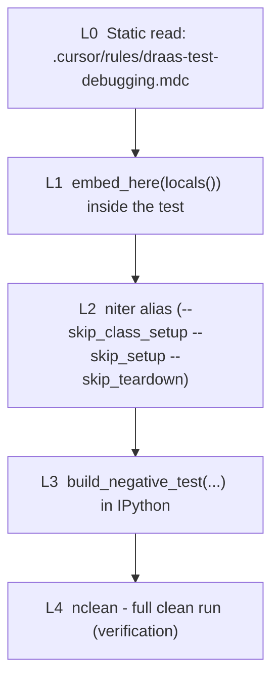

# Fast Dev Loop - efficient QA cheatsheet

A glance-and-go reference for fixing nutest tests without paying setup
cost on every change. Companion to [`scripts/dev_loop.py`](scripts/dev_loop.py)
and [`scripts/nutest_aliases.sh`](scripts/nutest_aliases.sh).

This doc captures the full QA process - debug loop, IDE setup,
test-authoring conventions, pre-push checks, Gerrit CR workflow, and
regression prevention - in cheatsheet form. It deliberately does NOT
re-derive architecture (see [`scripts/nutest_framework_guide.md`](scripts/nutest_framework_guide.md))
nor teach pytest unit tests (see [`scripts/framework_testing_guide.md`](scripts/framework_testing_guide.md))
nor duplicate the debug checklist (see [`.cursor/rules/draas-test-debugging.mdc`](.cursor/rules/draas-test-debugging.mdc)).

---

## 1. TL;DR - the four commands you actually run

```bash
# One-time per setup. Runs setup() + test, then leaves the cluster up.
nfirst <test-path> --resources NOS:... NOS:... PC:... PC:...

# Iterate INSIDE IPython at your embed_here() breakpoint:
#   reload_modules("workflows.draas.draas_library")
#   self.draas_wo.trigger_rpj(...)

# If you exit IPython but cluster state is still good, re-run cheap:
niter <test-path> --resources ...

# Final verification with full teardown before pushing:
nclean <test-path> --resources ...
```

The aliases (`nfirst` / `niter` / `nclean` / `ndev`) are defined in
[`scripts/nutest_aliases.sh`](scripts/nutest_aliases.sh) - source that
file from `~/.zshrc` or `~/.bashrc` once.

---

## 2. The 5-layer debugging pyramid

Use the cheapest layer that gives you a real answer. Climb only when
forced.



### L0 - static analysis (free, instant)

Run the checklist at [`.cursor/rules/draas-test-debugging.mdc`](.cursor/rules/draas-test-debugging.mdc).
Most logic bugs are findable from the stack trace + the failing
validator + the test config field. Only escalate if static reading
doesn't yield a hypothesis.

### L1 - breakpoint inside the live test (biggest win)

Edit the failing test, drop one line at the start of the failing
scenario block (NOT at the failure line - lets you single-step through
the scenario interactively):

```python
STEP("Stopping ergon service on remote PE.")
from scripts.dev_loop import embed_here; embed_here(locals())
remote_pe = self.remote_pe_list[0]
Ergon(remote_pe).stop()
...
```

Run once with `--skip_teardown` so the cluster survives when you exit:

```bash
nfirst dr.draas.merged_tests.recovery_plan_unplanned_failover.\
test_recovery_plan_unplanned_failover.NegativeTest.test_upfo_error_scenarios \
    --resources NOS:... NOS:... NOS:... PC:... PC:...
```

At the IPython prompt you have `self`, `self.draas_wo`, `self.test_args`,
`#TAG` lookups via `self.draas_wo.dr_config.get_entities(...)` - all
real, all wired to the live cluster. Iterate WITHOUT restarting nutest:

```python
self.draas_wo.pc_entities[self.remote_pc.svms[0].ip][DraasWorkflow.RPJ].get()

reload_modules("workflows.draas.draas_library")
self.draas_wo.trigger_rpj(recovery_plan=rp, action='FAILOVER')
```

Caveat: `importlib.reload` works for plain module-level functions; for
already-instantiated objects you may need to re-bind or re-instantiate
the holder. For framework-deep changes, drop to L2.

### L2 - re-run with class state still up

When the IPython namespace is dirty but the cluster state from your
`nfirst` run is still intact:

```bash
niter <test-path> --resources ...
```

Preserves: cluster-side state (categories, VMs, snapshots, recovery
plans, protection rules, remote-site pairings).

Does NOT preserve: `self`. Each `nutest run` is a fresh Python
process. For the unplanned-failover test, `setup()` rebuilds
`self.draas_wo` cheaply from cluster discovery, so iteration is still
much faster than a full clean run.

### L3 - instantiate the test class in IPython

Use this when you want to drive the test from scratch in IPython, or
investigate `setup()` itself, or work on a setup someone else handed
you. Helpers in [`scripts/dev_loop.py`](scripts/dev_loop.py):

```python
from scripts.dev_loop import build_negative_test
t = build_negative_test(
    pc_clusters=[pc1, pc2],
    pe_clusters=[pe1, pe2, pe3],
    test_args={
        "dummy_vm": False,
        "categories": [{"category": {"dept": "hr"}, "uvm_count": 1}],
        "protection_rule_categories": [
            {"category": {"dept": "hr"}, "filter_type": "CATEGORY"}],
        "recovery_plan_stages_1": [
            {"category": {"dept": "hr"}, "delay": 60,
             "entity_filter_type": "CATEGORIES"}],
        "sleep": 60,
    },
)
# t.draas_wo, t.source_pc, t.remote_pe_list, ... live; call any sub-step.
t.draas_wo.do_setup(create_uvm=False, create_rp=False)
```

Generic factory for other test classes:

```python
from scripts.dev_loop import build_test_instance
t = build_test_instance(SomeTest,
    pc_clusters=[pc1, pc2], pe_clusters=[pe1, pe2],
    test_args={...}, run_setup=True)
```

Worked example for the PHASE-K acropolis race:
[`scripts/debug_upfo_error_scenarios.py`](scripts/debug_upfo_error_scenarios.py).

### L4 - full clean run

Reserved for:

- You changed `setup()` itself.
- Cluster state is corrupted (failed teardown, leftover PDs, dangling
  RPJs that block creation).
- Pre-push verification.

```bash
nclean <test-path> --resources ...
```

---

## 3. Cursor Remote-SSH - stop copying files to the ubvm

Cursor runs locally on Mac, but filesystem / terminals / IPython /
debugger / AI all run on the ubvm. No more `scp`.

`~/.ssh/config` (already configured and verified):

```
Host ubvm
    HostName 10.111.51.158
    User roshan.salian
    IdentityFile ~/.ssh/id_ed25519
    ServerAliveInterval 60
    ServerAliveCountMax 3
```

Nutest checkout on the ubvm: `/home/roshan.salian/Nutest`.
IPython on the ubvm: `/home/roshan.salian/.pyenv/shims/ipython`.

Steps in Cursor on Mac:

1. `Cmd+Shift+P` -> "Remote-SSH: Connect to Host" -> pick `ubvm`.
   If the command isn't there, install the "Remote - SSH" extension
   from the Extensions panel first.
2. A new Cursor window opens, attached to the VM.
3. File -> Open Folder -> `/home/roshan.salian/Nutest`.

From here on: edits, AI requests, terminals, IPython, and the debugger
all run on the ubvm. The L1 workflow above only works if your edits
are visible to the running test process - Remote-SSH makes "the file
you edit" and "the file nutest runs" the same file by construction.

Optional: IDE breakpoints (instead of `embed_here()`):

- `pip install debugpy` in the nutest venv on the ubvm.
- `import debugpy; debugpy.listen(5678); debugpy.wait_for_client()` in
  the test, or a launch wrapper.
- Cursor -> Run and Debug -> "Attach to Python" pointing at
  `localhost:5678` (Remote-SSH auto-forwards the port).
- Click gutter to set breakpoints, inspect `self.*` in the Variables
  pane.

`embed_here()` is simpler and equally powerful for nutest work;
pick whichever fits your muscle memory.

---

## 4. Companion artifacts map

| File | Layer | What it gives you |
|------|-------|-------------------|
| [`scripts/dev_loop.py`](scripts/dev_loop.py) | L1 / L3 | `embed_here`, `reload_modules`, `build_test_instance`, `build_negative_test` |
| [`scripts/nutest_aliases.sh`](scripts/nutest_aliases.sh) | L1 / L2 / L4 | `nfirst`, `niter`, `nclean`, `ndev`, plus existing `nrun`/`nipy`/`nlint` |
| [`scripts/test.py`](scripts/test.py) | L3 | Live worked examples - cluster setup blocks, entity specs, PD/RP workflows; tail has the test-class instantiation pattern |
| [`scripts/debug_upfo_error_scenarios.py`](scripts/debug_upfo_error_scenarios.py) | L3 | PHASE-K acropolis-race reproducer; mirrors `test_upfo_error_scenarios` setup + PHASE-J/K |
| [`scripts/setup_session.py`](scripts/setup_session.py) | L3 | `nipy` / `ndev` IPython bootstrap: imports, `quick_setup()`, helpers auto-loaded |
| [`scripts/helpers.py`](scripts/helpers.py) | L3 | Reusable RP / RPJ / cluster helpers loaded by `setup_session.py` |
| [`.cursor/rules/draas-test-debugging.mdc`](.cursor/rules/draas-test-debugging.mdc) | L0 | Debugging checklist + common failure patterns |

---

## 5. Test-authoring conventions (nutest-specific)

The pieces a DRaaS test depends on. Cross-link out for depth.

### config.json - 3-tier override chain

Later overrides earlier:

1. `global_config` block at top of `config.json`.
2. Class-level `test_config` (e.g. `NegativeTest`).
3. Method-level `test_config` (e.g. `NegativeTest.test_upfo_error_scenarios`).
4. CLI `-a key=value` (last word).

Entity dict at the test level recursively merges INTO the class-level
via `recursive_update`. Always check BOTH levels when chasing a "where
is this value coming from" question.

Reference: the per-test entry in
[`testcases/dr/draas/merged_tests/recovery_plan_unplanned_failover/config.json`](nutest-py3-tests/testcases/dr/draas/merged_tests/recovery_plan_unplanned_failover/config.json)
and the override-chain section in
[`.cursor/rules/draas-test-debugging.mdc`](.cursor/rules/draas-test-debugging.mdc).

### Entity `#TAG` resolution

Tags like `#VM1`, `#CAT_CAT1_VAL1`, `#PD10_VG1` are resolved by
`SpecHelper` -> `DrConfig.get_entities()`. You never have to wire them
yourself.

```python
self.draas_wo.dr_config.get_entities(DrEntityType.VM, "SITE_1")
# returns DrVm objects with their #TAG metadata
```

Rule of thumb: never construct an RP spec by hand in IPython - use
`draas_wo.create_recovery_plans(spec, use_v4=True)` so `SpecHelper`
dedupes and resolves tags. Hand-built specs are how you hit "Duplicate
VM entity found in the request" 400s.

### V3 vs V4 - which workflow class?

| Workflow class | Module | Used by |
|----------------|--------|---------|
| `DraasWorkflow` | [`workflows/draas/draas_workflows.py`](nutest-py3-tests/workflows/draas/draas_workflows.py) | V3 / legacy tests (incl. `test_upfo_error_scenarios`) |
| `DrWorkflow` | [`workflows/draas3/workflow.py`](nutest-py3-tests/workflows/draas3/workflow.py) | V4 tests (incl. `pd_to_ec_migration`, `v4_runbook_apis`) |

Don't import both in the same IPython session unless you mean to -
they share method names but very different semantics.

### Resource specs / topology

The class-level `resource_spec` typically references a topology JSON:

```json
"resource_spec": [
  {"config": {"path": "testcases/dr/draas/topology/onprem_3pe_2pc.json"},
   "type": "$TOPOLOGY"}
]
```

Topology files live in
[`testcases/dr/draas/topology/`](nutest-py3-tests/testcases/dr/draas/topology/)
(102 variants - on-prem vs Xi, AHV vs ESX, PE/PC counts). Use what the
test's config asks for, not a "looks similar" alternative.

### Logging - STEP at scenario boundaries

`framework.lib.nulog` exposes `STEP / INFO / DEBUG / WARN / ERROR`.

- Use `STEP("...")` to mark scenario boundaries. The L1 workflow grep
  the failing `STEP(...)` line out of logs to know where to put
  `embed_here()`. Keep STEPs informative (`"Stopping ergon service on
  remote PE"`, not `"Step 4"`).
- Use `INFO/DEBUG` for state dumps inside a scenario.
- Use `WARN/ERROR` for things you'd want to see in a log review even
  if the test passes.

### Megatest anti-pattern

If your test has 20+ `STEP()` calls, it's too long. Real example:
[`test_recovery_plan_unplanned_failover.py:354`](nutest-py3-tests/testcases/dr/draas/merged_tests/recovery_plan_unplanned_failover/test_recovery_plan_unplanned_failover.py)
- `test_upfo_error_scenarios` has ~30 STEPs covering 8 independent
failure-injection scenarios. End-to-end runs take 30+ minutes and
fail an hour into the loop.

Mitigation:

- In dev: drop `embed_here()` at the start of the failing scenario, NOT
  at scenario 1.
- For repeated work on the test: extract each scenario into its own
  private method called sequentially by the megatest. Don't merge the
  split unless the team agrees, but it pays off on the third iteration.

---

## 6. Pre-push verification

Five cheap checks before `git push`. Each fixes a CI failure you'd
otherwise discover an hour later.

```bash
# 1. Verify your test actually passes end-to-end (L4).
nclean <your-test> --resources ...

# 2. If you touched setup() or teardown(), smoke-test it:
nfirst <your-test> --resources ...
#   ...exit; if teardown left the cluster dirty, that's a leak.

# 3. Lint Python locally.
nlint <changed-file>
# Or directly:
python nutest-py3/thirdparty_tools/nutest_linter/nutest_linter.py <file>

# 4. Run sibling tests in the same file (they share your helper).
nclean dr.draas.merged_tests.recovery_plan_unplanned_failover.\
test_recovery_plan_unplanned_failover.NegativeTest.test_tfo_error_senarios \
    --resources ...

# 5. Make sure no debug breakpoint sneaked in.
rg -n "embed_here\(|from IPython import embed" testcases/ workflows/
# Should return nothing in your diff.
```

---

## 7. Gerrit CR workflow

The always-applied workspace rule "DPRO-Gerrit-Push-For-Review" forbids
direct branch pushes. The recipe:

### Push to the review ref, not the branch ref

```bash
# GOOD - opens / updates a Change Request:
git push origin HEAD:refs/for/master

# BAD - bypasses Gerrit code review entirely:
git push origin master
```

For non-master target branches:

```bash
git push origin HEAD:refs/for/<branchname>
```

### Commit message format

The repo's existing commits follow a Gerrit-style format. Sample from
`git log --oneline`:

```
7aa200ac5dd Fix for stale entities detected before TFO is run in test - test_upfo_error_scenarios
b8de94e3cea Handle failures seen with MstClusterRedeployNewPcOp Tickets resolved : ENG-916360 Reviewers : Target release : master
2e23bc94979 Add test test_zc_creation_with_pc_to_pc_synced_rp Tickets resolved : ENG-892947 Reviewers : Target release : master
```

Use this shape:

```
<Imperative title naming the test / feature>

<Body explaining why - 2-4 lines. Cite the failure mode you fix.>

Tickets resolved       : ENG-NNNNNN
Reviewers              : <comma-separated logins>
Target release         : master
```

### Amend vs new patchset

To update a CR after review comments:

```bash
git add -u
git commit --amend                # keeps the same Change-Id footer
git push origin HEAD:refs/for/master
```

Gerrit recognizes the unchanged `Change-Id:` line and adds your push as
a new patchset on the existing CR, NOT as a new CR.

### Hard "never do this" rules

- Never `git push --force` to `master`.
- Never `git push origin <branch>` when you mean to open a CR (use
  `refs/for/<branch>`).
- Never `--no-verify` to skip hooks unless explicitly authorized.
- Never amend a commit that's already been merged.

---

## 8. Regression prevention

### Before merge

Cover sections 6 (pre-push) and 7 (CR).

### After merge

- **Subset re-run on a fresh cluster.** Whatever test suite owns your
  area (e.g. `dr.draas.merged_tests.*`), kick it off on a clean setup
  after merge - integration regressions show up here, not in a
  single-test rerun.
- **ENG ticket discipline.** When fixing a bug:
  - Reference `ENG-NNNNNN` in the commit message (footer).
  - Add a code comment if the workaround is non-obvious or relies on
    framework behavior that may change. Example pattern already in the
    codebase: VG protection-status hardcoded `True` with `ENG-284199`
    cited inline (see
    [`.cursor/rules/draas-test-debugging.mdc`](.cursor/rules/draas-test-debugging.mdc)).
- **Don't merge debug breakpoints.** Run the grep in section 6 step 5
  as the last thing before push. If your commit hook supports it, wire
  this in.

### Pre-merge sanity (CI surrogate)

If CI is slow or queued, run this on the ubvm before the CR is even
posted:

```bash
# Your test + the most-related sibling, both end-to-end.
nclean <your-test> --resources ...
nclean <sibling-test> --resources ...
```

Cheap insurance against the "my CR broke the build" message at 6pm.

---

## 9. Anti-patterns to retire

The mental model is: every minute waiting for setup is a minute not
debugging.

- **End-to-end run -> read log -> fix -> end-to-end run.** Megatests
  punish this loop linearly with their length. Use L1.
- **`scripts/test.py` to debug a known-failing test.** Use L1 - you
  get `self` and `#TAG` resolution for free. L3 (`scripts/test.py`
  pattern, `build_test_instance(...)`) is for setup work, not for
  fixing a specific failing test.
- **Editing on Mac, scp to ubvm.** Replaced by Cursor Remote-SSH
  (section 3).
- **Running setup just to probe a property.** Use `niter` against a
  `nfirst`'d cluster.
- **Hand-built RP / RPJ specs in IPython.** Bypasses `SpecHelper`'s
  dedup + tag resolution. Use `draas_wo.create_recovery_plans(...)`.
- **Committing the `embed_here(` line.** Add it to the pre-push grep
  (section 6, step 5).
- **Pushing to `refs/heads/<branch>` instead of `refs/for/<branch>`.**
  Bypasses CR entirely. The always-applied rule forbids this.
- **Megatest authoring without an "extract scenario" plan.** 30+
  STEPs in one method = guaranteed multi-hour debug sessions. Plan the
  split before merge.
