# Nutanix Testing Framework — System Design

Author's note: this document is a top-down architecture deep dive of the Nutanix testing framework as it lives in this workspace. Every file reference points to a real file in `nutest-py3/` (the framework) or `nutest-py3-tests/` (the test code). The last third walks two real test files end to end so the moving parts of the framework are seen in context.

---

## Table of contents

1. [Executive summary](#1-executive-summary)
2. [High-level architecture](#2-high-level-architecture)
3. [Process model and IPC](#3-process-model-and-ipc)
4. [CLI surface](#4-cli-surface)
5. [Test discovery and loading](#5-test-discovery-and-loading)
6. [Configuration cascade](#6-configuration-cascade)
7. [Test lifecycle state machine](#7-test-lifecycle-state-machine)
8. [Resource, interface, entity, component model](#8-resource-interface-entity-component-model)
9. [Base test classes](#9-base-test-classes)
10. [Logging — NuLog](#10-logging--nulog)
11. [Results and reporting](#11-results-and-reporting)
12. [Exception model and failure handling](#12-exception-model-and-failure-handling)
13. [Extension points](#13-extension-points)
14. [Deep dive A — V4 Recovery Plan APIs test](#14-deep-dive-a--v4-recovery-plan-apis-test)
15. [Deep dive B — PD to EC Migration test](#15-deep-dive-b--pd-to-ec-migration-test)
16. [Cross-cutting trade-offs](#16-cross-cutting-trade-offs)
17. [Glossary and quick reference](#17-glossary-and-quick-reference)

---

## 1. Executive summary

NuTest is Nutanix's in-house functional test framework for cluster-level testing. The five things that define it:

- **It is a test driver, not a unit test runner.** Every test runs against one or more live Nutanix clusters (Prism Element, Prism Central, NuCAS, and others). The framework provisions cluster handles, sets up entities, runs the test body, validates state, and tears down — across a distributed system with hundreds of moving services.
- **It is two repos, not one.** [`nutest-py3/`](nutest-py3/) is the framework (test driver, base classes, resource model, interfaces, components, entities). [`nutest-py3-tests/`](nutest-py3-tests/) is the test code (testcases, workflows, helpers, validators). The framework is pip-installable (`NutestFramework` in [`pyproject.toml`](nutest-py3/pyproject.toml)) and the tests repo depends on it.
- **It is multi-process by design.** A test run is a process tree: the CLI spawns a scheduler, which spawns a per-class runner subprocess, which spawns a per-test runner subprocess, with a separate Bottle webserver subprocess holding shared state. See [`framework/test_driver/`](nutest-py3/framework/test_driver/).
- **Configuration is a cascade, not a fixture.** Test parameters flow through five layers: global → package `config.json` → class → test method → CLI `-a` args. Resource specs come from Jinja2 templates. See [`framework/config/config.json`](nutest-py3/framework/config/config.json) and [`framework/test_driver/nutest_config_parser.py`](nutest-py3/framework/test_driver/nutest_config_parser.py).
- **Tests interact with entities, not raw APIs.** A test creates a `Vm` object, a `RecoveryPlan` object, a `ProtectionDomain` object — and the framework abstracts over the interface (REST v3, REST v4, ACLI, NCLI, NUCLEI, SDK, RPC). See [`framework/entities/`](nutest-py3/framework/entities/) and [`framework/interfaces/interface.py`](nutest-py3/framework/interfaces/interface.py).

---

## 2. High-level architecture

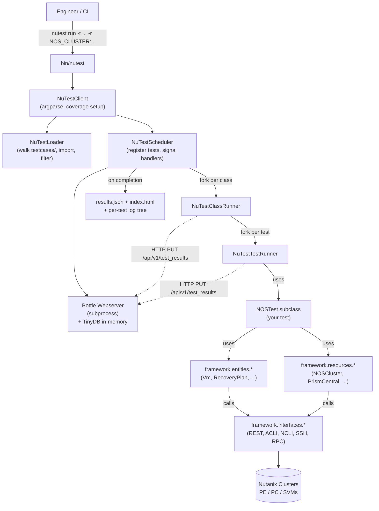

| Process | Source | Responsibility |
| --- | --- | --- |
| `nutest` CLI | [`bin/nutest`](nutest-py3/bin/nutest) | Entrypoint shim. Sets up egg/wheel paths, hands off to `NuTestClient`. |
| `NuTestClient` | [`framework/test_driver/nutest_client.py`](nutest-py3/framework/test_driver/nutest_client.py) | argparse, subcommand routing (`run`/`find`/`clusters`/`lint`/`install`/`generate-config-refs`), coverage init, log dir setup. |
| `NuTestLoader` | [`framework/test_driver/nutest_loader.py`](nutest-py3/framework/test_driver/nutest_loader.py) | Walks `testcases/`, imports modules, finds `NuTest` subclasses, applies tag filters, expands class/test variations. |
| `NuTestScheduler` | [`framework/test_driver/nutest_scheduler.py`](nutest-py3/framework/test_driver/nutest_scheduler.py) | Groups tests by class, starts webserver subprocess, forks a `NuTestClassRunner` process per class, signal handler for SIGINT/SIGTERM, dumps `results.json` + `index.html`. |
| `NuTestClassRunner` | [`framework/test_driver/nutest_class_runner.py`](nutest-py3/framework/test_driver/nutest_class_runner.py) | Runs one test class: initializer → class_pre_run → class_setup → tests → class_teardown → class_post_run. Forks `NuTestTestRunner` subprocesses for each test method. |
| `NuTestTestRunner` | [`framework/test_driver/nutest_test_runner.py`](nutest-py3/framework/test_driver/nutest_test_runner.py) | Runs one test method: pre_run → setup → test_body → teardown → post_run → log_normalization. |
| `NuTestWebserver` | [`framework/test_driver/nutest_webserver.py`](nutest-py3/framework/test_driver/nutest_webserver.py) | Bottle HTTP server in a dedicated subprocess. Stores results in an in-memory `NutestDB` (TinyDB). REST endpoints used by all the runner processes. |
| `NutestDB` | [`framework/test_driver/nutest_db.py`](nutest-py3/framework/test_driver/nutest_db.py) | TinyDB wrapper. Tables: `results`, `clusters`, `callbacks`, `parameters`, `nodes`. |

---

## 3. Process model and IPC

### Why multi-process

The framework forks a fresh process for each test class and each test method. That sounds heavy, but the reasons are deliberate:

- **Memory isolation.** A test that leaks memory or holds onto stale cluster connections does not poison the next test. Each test starts with a fresh interpreter state.
- **Signal handling.** Per-stage timeouts use `signal.SIGALRM` (see [`framework/test_driver/timeout_listener.py`](nutest-py3/framework/test_driver/timeout_listener.py) — `TimeoutListener` / `TimedExecutor`). Signals are per-process; one process cannot SIGALRM another's main thread reliably from Python.
- **Coverage support.** `coverage.py` is started in the parent and propagated via the `COVERAGE_PROCESS_START` environment variable to child processes (see `__setup_coverage` in [`nutest_client.py:1054-1076`](nutest-py3/framework/test_driver/nutest_client.py)). Subprocesses are first-class citizens.
- **Graceful teardown on hang.** If a test hangs, the scheduler can SIGKILL the child and continue — without losing state, because state is in the webserver subprocess, not the runner.

### IPC: HTTP + in-memory TinyDB

The runner processes do not share state via `multiprocessing.Queue`. They talk to an HTTP server:

- The scheduler starts a Bottle webserver on a free port (see `__start_webserver` in [`nutest_scheduler.py:548-595`](nutest-py3/framework/test_driver/nutest_scheduler.py)).
- The base URL is exported via the `NUTEST_BASE_URL` environment variable so any subprocess can find it.
- Test result updates, parameters, and registered callbacks all go through `PUT`/`POST`/`GET` calls.
- Storage is `TinyDB` with `MemoryStorage` — see [`nutest_db.py:43-51`](nutest-py3/framework/test_driver/nutest_db.py).

The HTTP boundary gives three properties:

1. The webserver outlives any individual test, so partial results survive a crashed test runner.
2. The same endpoints can be hit by humans (the HTML report at `/` is served by the same webserver) or by remote orchestrators.
3. Callbacks registered in one process can be invoked from another, with the webserver acting as the broker (see `register_callback`/`invoke_callback` in [`framework/lib/test/nutest.py:112-152`](nutest-py3/framework/lib/test/nutest.py)).

### Process tree at runtime

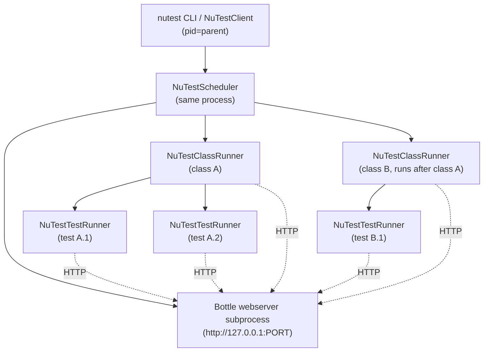

Classes run serially (see `__run_tests` at [`nutest_scheduler.py:417-453`](nutest-py3/framework/test_driver/nutest_scheduler.py)). Within a class, non-destructive (`@readonly`) tests run in parallel batches; destructive tests run serially (see `__execute_non_destructive_tests` and `__execute_destructive_tests` at [`nutest_class_runner.py:377-457`](nutest-py3/framework/test_driver/nutest_class_runner.py)).

---

## 4. CLI surface

The CLI is built with `argparse` and lives in [`framework/test_driver/nutest_client.py`](nutest-py3/framework/test_driver/nutest_client.py). The five subcommands:

| Subcommand | Purpose | Key flags |
| --- | --- | --- |
| `run` | Run one or more tests on cluster resources. | `-t TEST [TEST ...]`, `-r TYPE:NAME [TYPE:NAME ...]`, `-a KEY=VAL [KEY=VAL ...]`, `--test_args_file FILE`, `--config_file FILE`, `--tags TAG [TAG ...]`, `--exclude`, `-D DIR`, `-o LOG_DIR`, `-i INTERFACE_TYPE`, `--iterations N`, `--abort_on_failure`, `--coverage`, `--profile`, `--memory_profiling`, `--skip_setup`/`--skip_teardown`/`--skip_class_setup`/`--skip_class_teardown`. |
| `find` | List tests matching a prefix/tags. | `[test_prefix]`, `--tags`, `--exclude`, `--filter FIELD=VAL`, `--json`, `-v`/`-vv`. |
| `clusters` | Print cluster info from Jarvis. | `-c CLUSTER_NAME ...`. |
| `lint` | Run NuTest linter (custom pylint config). | `-f FILES` or `-c COMMIT`. |
| `install` | pip install a NuTest add-on package from internal Artifactory. | `package`, `-U`. |
| `generate-config-refs` | Emit a JSON map of template files → config files that reference them. | `-o OUTPUT_PATH`. |

A typical invocation, used in this workspace's DRaaS tests:

```bash
nutest run \
  -t dr.draas.entity_protection_recovery.v4_runbook_apis.test_v4_recovery_plan_apis.V4RecoveryPlanTests.test_v4_api_create_rp \
  -r NOS_CLUSTER:srcpe NOS_CLUSTER:dstpe PC:srcpc PC:dstpc \
  -a site_config_tag=\$CROSS_AZ \
  --tags \$AOS_DRAAS_TAR \
  -o /tmp/nutest_logs
```

Two design decisions worth noting:

- **Tests cannot be passed by file path** — they must be dotted Python module paths starting from the `testcases/` root (default `-D testcases`). The loader walks that directory and only treats `NuTest`-subclass classes as test candidates.
- **Resource passing is typed and named.** `-r NOS_CLUSTER:srcpe` says "give me a `NOSCluster` resource named `srcpe`". The format is validated by a regex in `_validate_resource` ([`nutest_client.py:1188-1233`](nutest-py3/framework/test_driver/nutest_client.py)) and the valid types come from `CMD_LINE_RESOURCE_NAME` in [`framework/lib/consts.py`](nutest-py3/framework/lib/consts.py).

---

## 5. Test discovery and loading

### What is a "test"?

A test is **a method whose name starts with `test`** on a class that **inherits from `NuTest`** (transitively — `NOSTest` is the common subclass). Discovery is in `NuTestLoader.__get_classes_from_module` and `__get_tests_from_class` in [`nutest_loader.py:1121-1167`](nutest-py3/framework/test_driver/nutest_loader.py).

Test names are dotted: `dr.draas.entity_protection_recovery.v4_runbook_apis.test_v4_recovery_plan_apis.V4RecoveryPlanTests.test_v4_api_create_rp`. The four levels are: package path → module → class → method.

### Loading flow

```mermaid
flowchart LR
    A["CLI -t prefix"] --> B["NuTestLoader.get_tests(test_prefix)"]
    B --> C["_get_module_names<br/>(os.walk testcases/)"]
    C --> D["__get_classes_from_module<br/>(importlib + inspect)<br/>(filter: issubclass NuTest)"]
    D --> E["__get_tests<br/>(method name starts with 'test')"]
    E --> F["Apply class/test variations<br/>(~~~ and ___ delimiters)"]
    F --> G["Apply --tags filter<br/>(include or --exclude)"]
    G --> H["Apply test_args_file<br/>(data-driven copies)"]
    H --> I["List of test dicts<br/>{test_name, test_class, test_method, test_config, ...}"]
```

### Class and test variations

Two delimiters carry meaning:

- `~~~` (`CLASS_VARIATIONS_DELIMITER` at [`consts.py:91`](nutest-py3/framework/test_driver/consts.py)) — a class name like `MyTests~~~self_az` is a "variation" of `MyTests`. The loader dynamically synthesizes a new class with the variation suffix using `type()` and registers a config block under the variation name.
- `___` (`TEST_VARIATIONS_DELIMITER` at [`consts.py:90`](nutest-py3/framework/test_driver/consts.py)) — a method name like `test_create___nearsync` is a variation of `test_create`.

Variations let you keep one Python implementation but ship multiple parameter-sets per JSON. The DRaaS RPJ tests use this heavily (e.g. `test_v4_api_rpj_precommit_self_az` is registered as a variation of `test_v4_api_rpj_precommit` — see how `config.json` keys both names independently).

### Test sets

A `.lst` file is a YAML doc with a top-level `testcases:` list. The loader reads it via `get_tests_from_test_set` in [`nutest_loader.py:687-731`](nutest-py3/framework/test_driver/nutest_loader.py). Used by CI to pin a stable set of tests for a job.

### Parallel discovery for large repos

For `nutest find`, discovery is parallelized: `get_test_names` uses a `multiprocessing.Pool` and `get_tests_parallel` uses `ProcessPoolExecutor` with a per-directory size threshold. Big directories (configurable `large_dir_step_size`, default 30 MB of test code) are recursively split. See [`nutest_loader.py:281-517`](nutest-py3/framework/test_driver/nutest_loader.py).

---

## 6. Configuration cascade

Five layers, last-wins:

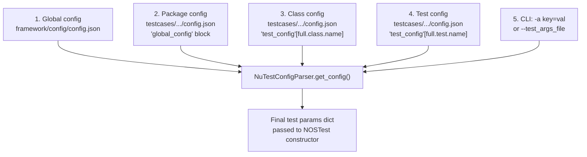

### The five layers in detail

1. **Framework global config** — [`framework/config/config.json`](nutest-py3/framework/config/config.json). Defines defaults for every timeout, log behaviour, NCC settings, expected fatals, etc. Look at the file — it is the minimum vocabulary the framework understands. Examples: `initializer_timeout: 2400`, `setup_timeout: 2400`, `test_timeout: 3600`, `interface_type: "ACLI"`, `use_logbay: true`.
2. **Package `config.json` `global_config` block** — e.g. [`testcases/dr/draas/entity_protection_recovery/v4_runbook_apis/config.json`](nutest-py3-tests/testcases/dr/draas/entity_protection_recovery/v4_runbook_apis/config.json) sets `setup_timeout: 7200`, `test_timeout: 108000000`, and a long list of `pre_run` hooks (e.g. `workflows.draas.draas_library.deploy_ncc`, `workflows.draas.dr_api_adonis_helper.patch_adonis`). These apply to every test in that package.
3. **Class-level `test_config` entry** — keyed by fully qualified class name, e.g. `"dr.draas.entity_protection_recovery.v4_runbook_apis.test_v4_rpj_apis.V4RpjApiTests"`. Defines `test_args`, `resource_spec`, etc. shared by every test method on that class.
4. **Test-level `test_config` entry** — keyed by fully qualified test name, e.g. `"dr.draas.entity_protection_recovery.v4_runbook_apis.test_v4_rpj_apis.V4RpjApiTests.test_v4_api_rpj_precommit"`. Overrides class-level for that specific test. The `entities` dict here is merged into the class-level `entities` dict via `recursive_update`.
5. **CLI overrides** — `-a key=value` (or a `--test_args_file` JSON file mapping). These win unconditionally.

The actual merging happens in `NuTestConfigParser.get_config` in [`framework/test_driver/nutest_config_parser.py`](nutest-py3/framework/test_driver/nutest_config_parser.py). The function is called twice per test — once during scheduling (`__process_and_group_tests_by_class` in [`nutest_scheduler.py:230-252`](nutest-py3/framework/test_driver/nutest_scheduler.py)) so the scheduler can route data-driven test_args into one test object per args entry, and once at class-runner construction time.

### Resource spec via Jinja2 template

`resource_spec` describes the cluster shape required. It can be inline JSON or, more commonly, a path to a Jinja2 `.j2` template:

```json
"resource_spec": [
  {
    "type": "$TEMPLATE",
    "config": {
      "params": {"pc_1_enable_anc": true, "pc_2_enable_anc": true},
      "path": "testcases/dr/draas/template/2pe_2pc.j2"
    }
  }
]
```

The template ([`testcases/dr/draas/template/2pe_2pc.j2`](nutest-py3-tests/testcases/dr/draas/template/2pe_2pc.j2)) is a JSON-with-Jinja document that describes the hardware/hypervisor/SVM requirements. The framework renders it and the resulting JSON is validated against the per-resource schema (e.g. [`framework/config/nos_cluster-schema.json`](nutest-py3/framework/config/nos_cluster-schema.json)). This is what RDM/Jarvis use to allocate a real cluster.

### Pre and post runs

`pre_run` / `post_run` config entries are lists of dicts:

```json
{
  "name": "workflows.draas.draas_library.deploy_ncc",
  "stage": "CLASS_PRERUN"
}
```

`stage` can be `CLASS_PRERUN`, `CLASS_POSTRUN`, `TEST_PRERUN`, `TEST_POSTRUN`, or `INITIALIZER`. The class runner / test runner pick up entries with matching stages at the right time (see `__execute_class_pre_run` at [`nutest_class_runner.py:593-628`](nutest-py3/framework/test_driver/nutest_class_runner.py) and `__execute_pre_run` at [`nutest_test_runner.py:383-...`](nutest-py3/framework/test_driver/nutest_test_runner.py)).

`initializer` is similar but special-cased: it runs once at the start of a class, before `class_pre_run`, and the [`framework/lib/initializer.py`](nutest-py3/framework/lib/initializer.py) `Initializer` class can ingest framework-managed steps (e.g. `change_prism_password` for cloud runs).

---

## 7. Test lifecycle state machine

Two state machines: one for a class run, one nested inside it for each test method.

### Class lifecycle

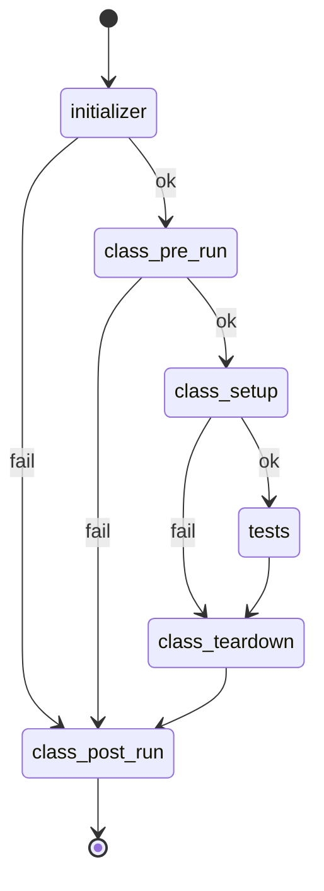

The success_map / failure_map are literal dicts in [`nutest_class_runner.py:52-63`](nutest-py3/framework/test_driver/nutest_class_runner.py):

```python
success_map = {'class_pre_run': 'class_setup',
               'class_setup': 'tests',
               'tests': 'class_teardown',
               'class_teardown': 'class_post_run',
               'class_post_run': 'break'}
failure_map = {'class_pre_run': 'class_post_run',
               'class_setup': 'class_teardown',
               'tests': 'class_teardown',
               'class_teardown': 'class_post_run',
               'class_post_run': 'break'}
```

Translation:

- **Class setup failure does not skip teardown.** Teardown is always invoked if setup was attempted, because setup may have partially provisioned resources that need cleanup.
- **Pre-run failure skips setup and tests.** A failed pre-run means the environment isn't ready, so don't make the situation worse.
- **Post-run always runs.** Best-effort cleanup at the cluster level (NCC log collection, panacea reports).
- **A teardown exception during post-run is downgraded to WARNING, not FAILED** — see [`nutest_class_runner.py:655-667`](nutest-py3/framework/test_driver/nutest_class_runner.py).

### Test lifecycle (per method)

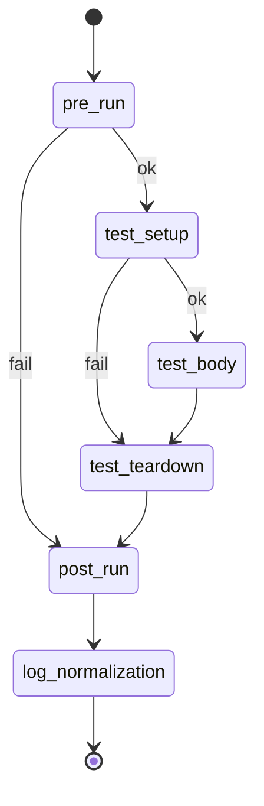

Same idea, in [`nutest_test_runner.py:52-65`](nutest-py3/framework/test_driver/nutest_test_runner.py):

```python
success_map = {'pre_run': 'test_setup',
               'test_setup': 'test_body',
               'test_body': 'test_teardown',
               'test_teardown': 'post_run',
               'post_run': 'log_normalization',
               'log_normalization': 'break'}
failure_map = {'pre_run': 'post_run',
               'test_setup': 'test_teardown',
               'test_body': 'test_teardown',
               'test_teardown': 'post_run',
               'post_run': 'log_normalization',
               'log_normalization': 'break'}
```

### Per-stage timeout

Every stage runs under a `TimedExecutor.execute(timeout, fn, ...)` call. Internally that is `TimeoutListener` ([`framework/test_driver/timeout_listener.py`](nutest-py3/framework/test_driver/timeout_listener.py)):

- On POSIX: `signal.signal(signal.SIGALRM, handler); signal.alarm(timeout)`.
- On Windows: a `WinAlarm` daemon thread that sleeps and raises `NuTestRunnerTimeoutError` in the main thread.

If a stage times out, `enable_stack_dump_on_timeout` (true by default) triggers `dump_stack_processes()` to write the active stack of every Python thread and known cluster process. This makes "the test hung" debuggable.

### Non-destructive parallel batching

Tests marked `@readonly` (see [`framework/lib/decorators.py:146-...`](nutest-py3/framework/lib/decorators.py)) are run in parallel batches of size `readonly_batch_limit` (default 10). All others run serially after the batch is drained. This is in `__execute_non_destructive_tests` / `__execute_destructive_tests` at [`nutest_class_runner.py:377-457`](nutest-py3/framework/test_driver/nutest_class_runner.py).

### Abort-on-failure

`--abort_on_failure` (CLI) → `consts.ABORT_ON_FAILURE = True` → on failure, the test runner exits with `ABORT_EXIT_CODE = 99`. The class runner sees the 99, marks subsequent tests `SKIPPED`, and bubbles 99 up. The scheduler sees it too, marks subsequent classes `SKIPPED`, and exits.

---

## 8. Resource, interface, entity, component model

These four are the abstraction layers a test code author touches in increasing order of specificity.

### Resource

A `Resource` is a *thing the test runs against*: a cluster, a Prism Central, an AVM, a Selenium VM, a Kubernetes cluster, etc. Defined as a typed enum string in [`framework/lib/consts.py:51-82`](nutest-py3/framework/lib/consts.py):

```python
class ResourceType:
  NOS_CLUSTER = "$NOS_CLUSTER"
  PRISM_CENTRAL = "$PRISM_CENTRAL"
  XI_PORTAL = "$XI_PORTAL"
  AVM = "$AVM"
  KUBE_CLUSTER = "$KUBE_CLUSTER"
  EXTERNAL_STORAGE = "$EXTERNAL_STORAGE"
  ...
```

Object instantiation goes through the factory at [`framework/resources/resource.py`](nutest-py3/framework/resources/resource.py). `Resource(resource_type=ResourceType.NOS_CLUSTER, name="srcpe", ...)` returns a real `NOSCluster` object.

Resources have:
- A `name` and `resource_name` (alias).
- Cluster metadata sourced from Jarvis (`JARVIS_URL = "https://jarvis.eng.nutanix.com"` in [`consts.py:63`](nutest-py3/framework/test_driver/consts.py)) or RDM, or loaded from a JSON file via `--use_json`.
- SVM IPs (v4 and v6).
- One or more interfaces (REST/ACLI/NCLI/SSH).
- A hypervisor type.

### Interface

The *protocol* used to talk to a resource. [`framework/interfaces/interface.py`](nutest-py3/framework/interfaces/interface.py) is an enum:

```python
class Interface:
  NCLI = "NCLI"
  ACLI = "ACLI"
  ECLI = "ECLI"
  REST = "REST"
  RPC = "RPC"
  NATIVE = "NATIVE"
  NUCLEI = "NUCLEI"
  SDK = "SDK"
  ...
```

Each interface has an implementation directory under [`framework/interfaces/`](nutest-py3/framework/interfaces/): `rest/` (the `PrismClient` family with versioned subclasses like `PrismRestVersion.V3_0`, `V3_1`, `V4_0`), `ssh/`, `ncli/`, `acli/`, `rpc/`, etc.

The `interface_type` is set per test in config (`interface_type: "ACLI"` by default) and per-entity-call in code (entities accept an `interface_type=Interface.REST` kwarg).

### Entity

Domain objects you create, mutate, and delete. Each lives under [`framework/entities/`](nutest-py3/framework/entities/) (one directory per type, ~150 directories), and typically has multiple implementations (REST v3, REST v4, ACLI, NCLI). Examples used in our two test files:

| Entity | Path | Used in |
| --- | --- | --- |
| `Vm` | [`framework/entities/vm/vm.py`](nutest-py3/framework/entities/vm/vm.py) | both |
| `RecoveryPlan` (V4 REST) | `framework/entities/recovery_plan/rest_4_0_recovery_plan.py` | V4 RP test |
| `RESTProtectionDomain` | `framework/entities/protection_domain/rest_protection_domain.py` | PD-to-EC test |
| `RESTRecoveryPlan` | `framework/entities/recovery_plan/rest_recovery_plan.py` | PD-to-EC test |
| `RecoveryPlanJob` | `framework/entities/recovery_plan_job/recovery_plan_job.py` | V4 RP test |

The entity layer normalizes API drift across cluster versions — `Vm.create(...)` works whether the cluster speaks v3 or v4.

### Component

A *CVM-side service wrapper*. Components let tests inspect and manipulate the services that make up Nutanix (Cerebro for DR, Magneto/GoMagneto for runbook orchestration, Cassandra, Curator, etc.). Lives under [`framework/components/`](nutest-py3/framework/components/) — there are ~50 components, all subclasses of `BaseComponent`.

Used heavily for gflag manipulation. From the PD-to-EC test ([`test_pdtoec.py:255-263`](nutest-py3-tests/testcases/dr/draas/pd_to_ec_migration/test_pdtoec.py)):

```python
from framework.components.cerebro import Cerebro
...
for cluster in self.pe_clusters:
  try:
    Cerebro(cluster).clear_flags()
```

### Resource creation flow

```mermaid
flowchart LR
    A["CLI: -r NOS_CLUSTER:srcpe"] --> B["NuTestClient<br/>(parse, validate)"]
    B --> C["NOSTest.__init__<br/>(__handle_resources)"]
    C --> D["Resource factory<br/>resource.py:74-92"]
    D --> E["NOSCluster.__init__"]
    E --> F["NOSMetadataHelper<br/>(Jarvis API)"]
    F --> G["Cluster JSON<br/>(SVM IPs, hyp type, ...)"]
    G --> H["Interface setup<br/>(REST, SSH, NCLI)"]
    H --> I["Live cluster object<br/>(self.cluster)"]
```

`__handle_resources` is at [`framework/lib/test/nos_test.py:99-145`](nutest-py3/framework/lib/test/nos_test.py); it parallelizes object creation via `ParallelExecutor`.

---

## 9. Base test classes

Three classes form the inheritance chain a test author uses:

```
NuTest (abstract)
   ↑
NOSTest (cluster-based)
   ↑
YourTest (e.g., V4RecoveryPlanTests)
```

### `NuTest`

[`framework/lib/test/nutest.py`](nutest-py3/framework/lib/test/nutest.py). Abstract base, metaclass=`ABCMeta`. Provides:

- Stub `class_setup`, `setup`, `teardown`, `class_teardown` methods (each defaults to `pass`).
- `result` property: queries the webserver and returns the test's current result tuple.
- `set_param`/`get_param`/`delete_param`: cross-process key-value store (webserver-backed).
- `register_callback`/`invoke_callback`: register a function so another process can invoke it via HTTP.
- `__set_custom_data`/`__get_custom_data`: namespaced custom result fields.
- `update(**kwargs)`: stores test params on the instance.

`DEFAULT_RESOURCE_SPEC = []` — overridden by subclasses.

### `NOSTest`

[`framework/lib/test/nos_test.py`](nutest-py3/framework/lib/test/nos_test.py). The base class >95% of tests inherit from. Adds:

- `DEFAULT_RESOURCE_SPEC = [{"type": "nos_cluster"}]` — at minimum, requires one NOS cluster.
- Class attributes mirroring `ResourceType`: `NOS_CLUSTER`, `PRISM_CENTRAL`, `XI_PORTAL`, `AVM`, `KUBE_CLUSTER`, `EXTERNAL_STORAGE`, etc.
- `get_resource_by_name(name)`, `get_resources_by_type(type)`, `get_resources_by_tag(tag)` — query the resource set.
- `self.cluster`, `self.clusters`, `self.resources` populated in `__init__`.
- Tabulate-formatted resource summary logged at construction time.
- IPv6 / nested-AHV detection and env var propagation.
- Adds the standard pre/post runs (NCC log collection, cluster health check) via `__add_pre_post_runs`.

A test class typically looks like:

```python
class V4RecoveryPlanTests(NOSTest):
  def class_setup(self):
    self.pe_clusters = self.get_resources_by_type(self.NOS_CLUSTER)
    self.pc_clusters = self.get_resources_by_type(self.PRISM_CENTRAL)

  def setup(self):
    # per-test setup — create VMs, sites, etc.
    ...

  def test_v4_api_create_rp(self):
    # the body
    ...

  def teardown(self):
    ...
```

### Allowed methods

`NuTestClassRunner.__is_valid_test_class` ([`nutest_class_runner.py:680-714`](nutest-py3/framework/test_driver/nutest_class_runner.py)) enforces a strict allow-list of method names: anything not starting with `test` and not in `ALLOWED_TEST_METHODS` (see [`consts.py:23-49`](nutest-py3/framework/test_driver/consts.py)) is rejected at runtime. This prevents accidental "helper methods on the test class" from being mistaken for tests.

Real-world conclusion: helper methods live in a sibling module or in `workflows/`.

---

## 10. Logging — NuLog

NuLog is a thin wrapper around Python's `logging` module with custom levels and a notion of "stages". [`framework/lib/nulog.py`](nutest-py3/framework/lib/nulog.py).

### Custom levels

```python
logging.STAGE = 31   # higher than INFO
logging.STEP  = 32   # higher than STAGE
logging.TRACE =  9   # lower than DEBUG
```

```python
from framework.lib.nulog import ERROR, WARN, INFO, DEBUG, STAGE, STEP, TRACE
INFO("Creating VM")
STEP("Creating remote site for %s" % cluster.name)
STAGE("CLASS SETUP")
```

`STAGE` is used by the framework to mark transitions between lifecycle stages in the log. `STEP` is used by tests to mark major steps in the test body — search any DR test for `STEP(` and you'll see the conventions.

### Hierarchical log directory

A run lays out logs like:

```
logs/20260521_141502/
├── latest -> 20260521_141502/   (symlink)
├── nutest.log                    (scheduler-level)
├── results.json
├── index.html
├── dr/
│   └── draas/
│       └── entity_protection_recovery/
│           └── v4_runbook_apis/
│               └── test_v4_recovery_plan_apis/
│                   └── V4RecoveryPlanTests/
│                       ├── nutest_class.log
│                       ├── initializer.log
│                       ├── nutest_resource_object_creation.log
│                       ├── test_v4_api_create_rp/
│                       │   ├── nutest_test.log
│                       │   ├── nutest_resource_object_creation.log
│                       │   ├── test_exit_details.log
│                       │   └── code_active_state.log
│                       └── test_v4_api_rpj_tfo/
│                           └── ...
└── stats/                        (optional, when --profile)
```

### Context-managed redirection

The framework redirects logs for short-lived sub-stages via a context manager:

```python
with nulog.update_log_file(test_log_dir, "nutest_resource_object_creation.log",
                           test_log_dir, "nutest_test.log",
                           enable_steps_log=True):
  self._test_obj = self._test['test_class'](**self._params)
```

After the `with` block, logs go back to `nutest_test.log`. See [`nutest_test_runner.py:160-167`](nutest-py3/framework/test_driver/nutest_test_runner.py).

### Rotation and tarring

`--timed_log_rotate SECS` and `--sized_log_rotate MB` set up `TimedRotatingFileHandler` / `RotatingFileHandler`. `--tar_rotated_logs` gzips the rotations.

### Log analyser and normalization

After every test, `log_normalization` is its own lifecycle stage. Implementation lives under [`framework/lib/log_normalization/`](nutest-py3/framework/lib/log_normalization/). It collapses repeated noise, applies known patterns, and is configurable via the `log_normalization` block in [`framework/config/config.json`](nutest-py3/framework/config/config.json).

---

## 11. Results and reporting

### State machine

[`framework/test_driver/nutest_result.py`](nutest-py3/framework/test_driver/nutest_result.py):

```python
class NuTestResult:
  PENDING = 'PENDING'         # registered but not started
  RUNNING = 'RUNNING'         # currently executing
  PASSED  = 'PASSED'
  FAILED  = 'FAILED'          # test assertion / exception
  WARNING = 'WARNING'         # NuTestWarningError or post-run failure
  SKIPPED = 'SKIPPED'         # never reached
  TIMEDOUT = 'TIMEDOUT'       # exceeded stage timeout
  NOTFOUND = 'NOTFOUND'       # file present but test not loaded
  KILLED   = 'KILLED'         # user signal
  ABORTED  = 'ABORTED'        # abort-on-failure cascade
  ERROR    = 'ERROR'          # framework / env exception (NON_TEST_EXCEPTIONS)
```

Stages from `NuTestStage`:

```python
NOT_STARTED → INITIALIZER → CLASS_PRERUN → CLASS_SETUP →
TEST_PRERUN → TEST_SETUP → TEST_BODY → TEST_TEARDOWN → TEST_POSTRUN →
LOG_NORMALIZATION → CLASS_TEARDOWN → CLASS_POSTRUN → COMPLETED
```

The result row carries both the current `status` and an `error_stage` (the stage where the first failure occurred), so reports can say "FAILED in TEST_SETUP" not just "FAILED".

### TinyDB + webserver

`NutestDB` in [`framework/test_driver/nutest_db.py`](nutest-py3/framework/test_driver/nutest_db.py) is a TinyDB instance using `MemoryStorage`. Five tables:

- `results` — one row per test.
- `clusters` — registered cluster metadata.
- `callbacks` — registered cross-process callbacks.
- `parameters` — `set_param`/`get_param` storage.
- `nodes` — node-level metadata.

The Bottle webserver in [`framework/test_driver/nutest_webserver.py`](nutest-py3/framework/test_driver/nutest_webserver.py) exposes REST routes like:

- `GET  /` — HTML index (`index.html` jinja2 template)
- `GET  /api/v1/test_results` — list all results
- `PUT  /api/v1/test_results/<id>` — update a single result
- `GET  /api/v1/test_results/class/<class_name>` — all results for a class
- `POST /api/v1/test_results` — bulk update (e.g. SIGTERM-time)
- `POST/PUT /api/v1/parameters` — params CRUD
- `POST /api/v1/callbacks` — register callback

### Final artifacts

At scheduler shutdown (`__clean_up` in [`nutest_scheduler.py:268-348`](nutest-py3/framework/test_driver/nutest_scheduler.py)):

- The full results dump is fetched as JSON and written to `<log_dir>/results.json`.
- A pretty-printed table is logged to the scheduler's `nutest.log`.
- The HTML index is fetched from the webserver and saved as `<log_dir>/index.html`.
- The `static/` directory of CSS/JS is copied next to it (so the report is self-contained and portable).
- If `--coverage` was set, `coverage combine` + `coverage html`/`xml_report` produces `coverage/` under the log dir.

### Per-test custom data

Tests can attach JSON-serializable custom data to their result row via `self.custom_data.set('successful_operations', n)` (see `__set_custom_data` in [`nutest.py:225-271`](nutest-py3/framework/lib/test/nutest.py)). Keys must already exist in the schema (default keys are `total_operations` and `successful_operations`).

---

## 12. Exception model and failure handling

### Hierarchy

[`framework/exceptions/`](nutest-py3/framework/exceptions/) defines the family:

```
NuTestError                  (base)
├── NuTestValueError
├── NuTestOperationError
├── NuTestTimeoutError       (timeout class)
├── NuTestRunnerTimeoutError (per-stage timeout)
├── NuTestEntityOperationError
├── NuTestEntityOperationTimeoutError
├── NuTestInterfaceError
├── NuTestSSHTimeoutError
├── NuTestCommandExecutionError
├── NuTestPrismDownError
├── NutestPrismEditConflictError
├── NuTestResourceMismatchError
├── NuTestInvalidTestOperationError
├── NuTestDriverInternalError
├── NuTestWarningError       (degrades FAILED to WARNING)
├── NuTestComponentError
├── NuTestSystemError
├── NuTestAssertError
└── NuTestHypervisorError ...
```

### Inheritance enforcement

`NuTestError.__new__` ([`nutest_error.py:26-45`](nutest-py3/framework/exceptions/nutest_error.py)) walks the inheritance chain and raises if a subclass defined inside `framework/exceptions/` does not transitively inherit from `NuTestError`. This catches "someone tried to define an exception in the wrong place" at import time.

### Error categories

[`framework/lib/error_categorisation.py`](nutest-py3/framework/lib/error_categorisation.py) defines `ErrorCategory` subclasses (e.g. `USAGE`, `RESOURCE_OBJECT_CREATION`, `INVALID_TEST_CONFIG`, `INVALID_OPERATION`). Each `NuTestError` can carry a `category=ErrorCategory.X` kwarg, and the webserver records `failure_category_details = {category, debug_details, tags}` per result. This is what makes the report queryable for SRE-grade triage.

### Exception → status mapping

In `NuTestTestRunner.__execute_and_handle_exceptions` ([`nutest_test_runner.py:285-352`](nutest-py3/framework/test_driver/nutest_test_runner.py)):

| Exception class | Resulting status |
| --- | --- |
| `NuTestRunnerTimeoutError` | `TIMEDOUT` (also triggers `dump_stack_processes` and `save_comprehensive_shutdown_stats`) |
| `NON_TEST_EXCEPTIONS` (ArithmeticError, AttributeError, ImportError, NameError, KeyError, SyntaxError, TypeError, ValueError, NuTestInterfaceError, …) | `ERROR` — these indicate a framework/environment problem, not a product bug |
| `NuTestWarningError` | `WARNING` |
| any other `Exception` | `FAILED` |

### Collectors

`NuTestError(message, collector=some_obj)` — if `some_obj` has a `.collect()` method, it's invoked at exception construction time, unless the environment variable `SKIP_COLLECTORS=True` is set. This is used to grab "the relevant state of the cluster right now" before the trace is built — log snippets, current task list, etc.

### Active-state dump

`ExceptionDecoder.decode_exception(output_path="code_active_state.log")` writes a structured dump of the active Python frames at the point of failure (live locals, file:lineno per frame). Generated for every exception by the runners. Lives next to the test's `nutest_test.log`. Indispensable for debugging hangs that fail their stage timeout.

### Logbay auto-collection

On class-construction failure (i.e. before any test runs), the class runner triggers `Logbay.collect_logs_using_los(clusters, log_dir)` to pull CVM logs ([`nutest_class_runner.py:227-228`](nutest-py3/framework/test_driver/nutest_class_runner.py)). For PCs, `run_iam_diagnoser_on_obj_failure` also runs. These tarballs land under the per-class log directory.

---

## 13. Extension points

### Adding a new resource type

Five edits, in order:

1. Define a string constant in `ResourceType` ([`framework/lib/consts.py:51-82`](nutest-py3/framework/lib/consts.py)).
2. Register it in `CMD_LINE_RESOURCE_NAME` (same file, used by the CLI to validate `-r TYPE:NAME`).
3. Implement a resource class — subclass of `Resource` (or `BaseCluster` for cluster-like resources) under [`framework/resources/`](nutest-py3/framework/resources/) or [`framework/entities/cluster/`](nutest-py3/framework/entities/cluster/).
4. Wire it into the factory in [`framework/resources/resource.py:46-72`](nutest-py3/framework/resources/resource.py).
5. Add a JSON schema for its metadata under [`framework/config/<type>-schema.json`](nutest-py3/framework/config/).

### Adding a pre/post-run

In a package `config.json`:

```json
"pre_run": [
  {
    "name": "workflows.my_feature.my_helper.do_thing",
    "stage": "TEST_PRERUN",
    "timeout": 600,
    "kwargs": {"flavor": "spicy"}
  }
]
```

The framework imports the dotted path, calls `do_thing(test_obj)` (where `test_obj` has `pre_post_run_kwargs` pre-set with your `kwargs`), and applies the per-entry `timeout` or falls back to `pre_run_timeout`. The function can be a module-level function or an unbound method on a class.

Class detection is by capitalization of the second-to-last segment — see `__execute_function` at [`nutest_class_runner.py:533-563`](nutest-py3/framework/test_driver/nutest_class_runner.py).

### Decorators tests authors use

[`framework/lib/decorators.py`](nutest-py3/framework/lib/decorators.py):

- `@readonly` — marks the test non-destructive; parallel-batched with other readonly tests in the class.
- `@manual` — marks the test as not runnable in CI; adds `$MANUAL` tag.
- `@retry(times=N, exceptions=(...))` — retry on raised exception.
- `@profile` — cProfile wrap, output gated by env var `_NUTEST_PROFILE_FUNCTIONS`.
- `@memory_profile(log_name=...)` — tracemalloc snapshot.
- `@access_control('module1', 'module2')` — module-level access gate; raises `NuTestInvalidTestOperationError` if called from anywhere else. Used to keep low-level SSH classes out of test bodies.
- `@deprecated('newer_function')` — log a WARN naming the replacement.

### Custom interfaces

Add a directory under [`framework/interfaces/`](nutest-py3/framework/interfaces/) with your protocol class, add the string constant to `Interface` ([`interface.py:12-49`](nutest-py3/framework/interfaces/interface.py)), and have entities accept your `interface_type`.

### Registering callbacks (rare, but powerful)

```python
# in test body
eid = self.register_callback("workflows.my_feature.my_module.my_callback")
url = eid["invoke_url"]
# pass url to a subprocess / another tester / a cluster service that needs to call back
```

The other side does an HTTP POST to `url` (with kwargs in the body), and the webserver invokes `my_callback(**kwargs)` in *its* process. Used for orchestrating cross-cluster scenarios where one side needs to "ping" the test driver.

---

## 14. Deep dive A — V4 Recovery Plan APIs test

This deep dive walks [`test_v4_recovery_plan_apis.py`](nutest-py3-tests/testcases/dr/draas/entity_protection_recovery/v4_runbook_apis/test_v4_recovery_plan_apis.py) end to end.

### What the test suite does

The file defines `V4RecoveryPlanTests(NOSTest)` — a 12000-line suite that validates the V4 (formerly "Adonis") REST APIs for Recovery Plans and Recovery Plan Jobs. The suite covers:

- CRUD on Recovery Plans (`create`, `list`, `get`, `update`, `delete`) using the v4 SDK (`ntnx_dataprotection_py_client`).
- RBAC: creating users/roles/ACPs and confirming role-bound operations are permitted/denied as expected.
- Recovery Plan Jobs: VALIDATE / MIGRATE (planned failover) / TEST_FAILOVER / FAILOVER / FAILBACK / CLEANUP.
- Negative scenarios (duplicate IDs, edit conflicts, missing required fields).
- Network mapping, recovery settings, DSIP mappings.

### Test architecture

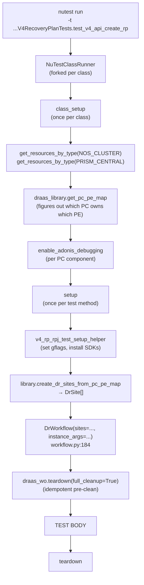

### Tag-based entity registry

The test reads its entities from `config.json` under `test_args.entities`. Each entity has a `template`, `tags`, and `spec`:

```json
"vms": [
  {
    "template": "$DEFAULT_WINDOWS_VM",
    "tags": ["#VM1"],
    "spec": {
      "name": "nu_windows_vm1",
      "categories": ["#CAT_CAT1_VAL1"],
      "post_create_ops": ["WAIT_FOR_IP", "GET_VM_IQN"]
    }
  }
]
```

Two token namespaces:

- `$X` — *template name*. Maps to a pre-defined entity skeleton in `DrConfig.spec_templates` (e.g. `$DEFAULT_WINDOWS_VM`, `$DEFAULT_CATEGORY`, `$DEFAULT_VG`, `$DEFAULT_PROTECTION_POLICY`, `$DEFAULT_V4_RECOVERY_PLAN_JOB`).
- `#X` — *entity tag*. A handle the test can later use to look up the created entity by name. Used in *cross-references*: a VM's `categories` field uses `#CAT_CAT1_VAL1` to bind to the category with that tag.

Resolution happens in `SpecHelper` ([`workflows/draas3/helpers/spec_helper.py`](nutest-py3-tests/workflows/draas3/helpers/spec_helper.py)) and `DrConfig.get_entities` ([`workflows/draas3/dr_config.py`](nutest-py3-tests/workflows/draas3/dr_config.py)).

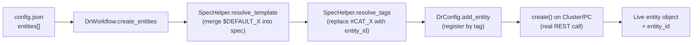

Tag references are *late-bound*: at the moment `vms[0].spec` is being built, the category it references may not yet exist. The SpecHelper resolves it after the category is created (in dependency order: categories → subnets → images → vms → vgs → protection_policies → recovery_plans).

### RPJ action sequence

The interesting V4-RPJ tests (e.g. `test_v4_api_rpj_precommit` in [`test_v4_rpj_apis.py`](nutest-py3-tests/testcases/dr/draas/entity_protection_recovery/v4_runbook_apis/test_v4_rpj_apis.py)) drive a *sequence* of RPJ actions against the same Recovery Plan. The sequence is declared in `config.json` under `test_args.rp_actions`:

```json
"rp_actions": {
  "rpj_validate":  {"template": "$DEFAULT_V4_RECOVERY_PLAN_JOB", "spec": {"action_type": "VALIDATE",      "recovery_plan": "#MY_RP1"}, "tags": ["#VALIDATE_RPJ"]},
  "rpj_pfo":       {"template": "$DEFAULT_V4_RECOVERY_PLAN_JOB", "spec": {"action_type": "MIGRATE",       "recovery_plan": "#MY_RP1"}, "tags": ["#RPJ_PFO"]},
  "rpj_failback":  {"template": "$DEFAULT_V4_RECOVERY_PLAN_JOB", "spec": {"action_type": "MIGRATE",       "recovery_plan": "#MY_RP1", "failover_directions": [...]}, "tags": ["#RPJ_FAILBACK"]},
  "rpj_tfo":       {"template": "$DEFAULT_V4_RECOVERY_PLAN_JOB", "spec": {"action_type": "TEST_FAILOVER", "recovery_plan": "#MY_RP1"}, "tags": ["#RPJ_TFO"]},
  "rpj_failover":  {"template": "$DEFAULT_V4_RECOVERY_PLAN_JOB", "spec": {"action_type": "FAILOVER",      "recovery_plan": "#MY_RP1"}, "tags": ["#RPJ_FAILOVER"]}
}
```

The standard order in a "precommit" test:

```mermaid
flowchart LR
    S[Start] --> V[VALIDATE]
    V --> PFO[PFO<br/>"MIGRATE"]
    PFO --> FB[FAILBACK<br/>"MIGRATE reverse direction"]
    FB --> TFO[TEST_FAILOVER]
    TFO --> CL[CLEANUP]
    CL --> FO[FAILOVER]
    FO --> E[End]
    V -.->|"validators"| Vw["WARNING_VALIDATION<br/>STATUS_VALIDATION"]
    PFO -.->|"validators"| Pw["WARNING_VALIDATION<br/>STATUS_VALIDATION<br/>ENTITY_PROTECTION_RESET"]
    TFO -.->|"validators"| Tw["WARNING_VALIDATION<br/>STATUS_VALIDATION<br/>RECOVERED_VM_VALIDATION"]
```

After each action:

- `RecoveryPlanJobValidator` ([`workflows/draas3/validators/recovery_plan_job_validator.py`](nutest-py3-tests/workflows/draas3/validators/recovery_plan_job_validator.py)) compares the RPJ's status, warning messages, and validation errors against the expected list.
- `ProtectionPolicyValidator` re-checks that all entities are protected (relevant after PFO/FAILBACK).
- `RecoveryPointValidator` verifies snapshot replication state if `validate_latest_snapshot_replication: True`.

### Per-action `shouldIgnoreWarnings`

A given RPJ action may legitimately emit warnings (e.g. a VG protection warning is expected on first PFO due to a known V4 API limitation). The config opts each action in or out of strict warning checking:

```json
"rpj_pfo": {
  "spec": {"action_type": "MIGRATE", ...},
  "shouldIgnoreWarnings": true
}
```

`recovery_plan_job_validator.validate_warnings_v4` (~line 588) reads this flag.

### How the class-level and test-level configs merge

The test class is registered under `"dr.draas...V4RpjApiTests"` and individual tests under `"dr.draas...V4RpjApiTests.test_v4_api_rpj_precommit"`. The `entities` dict at the test level is recursively merged into the class level. Specifically:

- A category list at the class level: `[{tag: #CAT_CAT1_VAL1, spec: ...}]`.
- A category list at the test level: `[{tag: #CAT_CAT2_VAL2, spec: ...}]`.
- The merge appends, giving the test access to both categories.

Test-level overrides for the same tag *replace* class-level entries. This is implemented via the cascade of `NuTestConfigParser.get_config` which calls `recursive_update` between layers.

### Failure-mode debugging workflow

When an RPJ test fails, the rule already shipped in this workspace ([`.cursor/rules/draas-test-debugging.mdc`](.cursor/rules/draas-test-debugging.mdc)) gives the workflow:

1. **Read the error**: identify the exception class (usually `NuTestError`), the validator method (e.g. `validate_warnings_v4`), and the RPJ action (look for `Performing RP action: rpj_tfo` in the log).
2. **Understand expected vs actual**: the error includes both `Warning messages passed: [...]` (expected) and `Warning messages got: [...]` (actual). For status failures, compare expected (usually `SUCCEEDED`) vs actual (e.g. `SUCCEEDED_WITH_VALIDATION_WARNING`).
3. **Trace the config**: re-check the cascade — `config.json` `global_config` → class `test_config` → test `test_config` → CLI `-a` overrides → `entities` dict merge — and compare with a passing variant if one exists (e.g. `self_az` vs `cross_az`).
4. **Common pitfalls**: VG protection status is not returned by V4 API (ENG-284199, hardcoded `True` in validator); `process_protection_policies` timeout often needs to be 1200s for post-failback protection; entity creation order matters.

### A concrete test method walk-through

`test_v4_api_create_rp` (the simplest path):

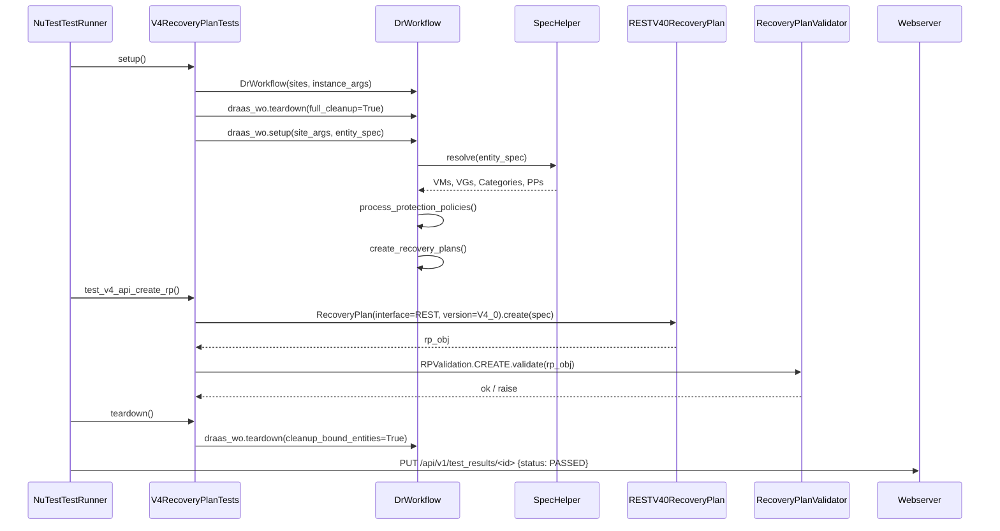

---

## 15. Deep dive B — PD to EC Migration test

This deep dive walks [`test_pdtoec.py`](nutest-py3-tests/testcases/dr/draas/pd_to_ec_migration/test_pdtoec.py) end to end.

### What the test does

`PDtoECMigration(NOSTest)` validates the API that converts legacy *Protection Domains* (PE-side, Cerebro-driven DR) into the *Entity Centric* DR model (PC-side, Magneto-driven categories + Protection Policies + Recovery Plans). It is the migration path for customers moving off legacy PD-based DR.

The main test method, `test_comprehensive_multi_pd_migration_with_various_configurations`, executes:

1. Run prechecks (dryrun) for all PDs to be migrated.
2. Assert every PD's precheck succeeded.
3. Run the actual migration (`dryrun='false'`).
4. Assert each PD migrated to `SUCCEEDED`.
5. Verify the source PDs on PE no longer have protected entities (`vms`/`vgs`/`files` should be empty).
6. Verify the destination PC has the expected count of Categories / Protection Policies / Recovery Plans, each correctly named.

### Setup flow

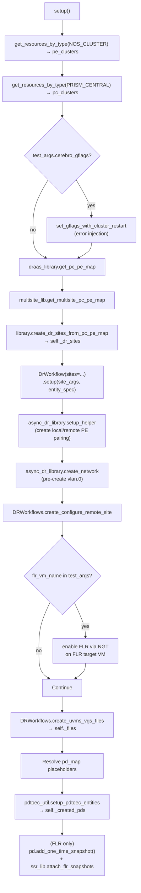

### The `pd_map` and its placeholders

`test_args.pd_map` from `config.json` is a dict of PD definitions, each containing a `name`, `protect_args`, `protect_calls`, and `schedules`. Several fields are *placeholders* that need resolution against the live test state:

| Placeholder | Resolves to |
| --- | --- |
| `$LARGE_PD_NAME` | A literal 75-character name (`"nutest_large_name_" + "x" * 57`) used to test name-length limits. |
| `$VG_UUIDS` | Comma-joined `entity_id` values of the VGs created earlier in setup. |
| `$FILES` | Comma-joined file paths from `DRWorkflows.create_uvms_vgs_files`. |
| `remote_cluster` / `remote_cluster_2` / `remote_cluster_3` | One of the resolved `remote_cluster*` resources from `entities_created`. |
| `remote_clusters` | All remote cluster handles. |

Resolution is done in setup (`test_pdtoec.py:172-220`). The code walks `pd_map.values()` and rewrites `name`, `protect_args`, `protect_calls`, and `schedules` in place. This pattern — config-with-placeholders that get bound to live runtime objects in `setup()` — is repeated across the DR test suite whenever configs need to reference dynamically created entities.

### The migration call

```python
# Step 3: Run prechecks (dryrun=true)
dryrun_details = self._draas_wo.convert_protection_domains(
  site=self._dr_sites[0],
  pds_to_convert_list=pds_to_convert_list,
  expected_pd_converted_entites_dict=None,
  dryrun='true',
  ext_id=self.local_cluster.entity_id
)

# Step 5: Actual migration (dryrun=false)
migration_details = self._draas_wo.convert_protection_domains(
  site=self._dr_sites[0],
  pds_to_convert_list=pds_to_convert_list,
  expected_pd_converted_entites_dict=expected_entities,
  dryrun='false',
  ext_id=self.local_cluster.entity_id
)
```

`DrWorkflow.convert_protection_domains` lives in [`workflows/draas3/workflow.py`](nutest-py3-tests/workflows/draas3/workflow.py); its real work is delegated to [`workflows/draas3/helpers/convert_protection_domains/convert_protection_domains_helper.py`](nutest-py3-tests/workflows/draas3/helpers/convert_protection_domains/convert_protection_domains_helper.py). Internally:

1. It calls the migration v4 REST API on the PC.
2. It polls the resulting Ergon task until `SUCCEEDED` or `FAILED`.
3. On success and when `expected_pd_converted_entites_dict` is provided, it invokes `ProtectionPolicyValidator.perform_validations` and `RecoveryPlanValidator.perform_validations` to confirm the new PC entities (Categories, PPs, RPs) exist and have the right shape.
4. Returns a dict keyed by PD name with `status`, `task_uuid`, and any error details.

### Post-migration verification

The test method enforces three properties:

1. **Migration status**. Every PD in `migration_details` must have `status == 'SUCCEEDED'`.
2. **Destination entities exist**. For each PD, the expected Category, Protection Policy, and Recovery Plan(s) (named with the PD name as prefix) exist in PC.
3. **Source PD is empty**. The original PD on PE has no `vms`, `vgs`, or `files`. The test handles the case where the PD has already been *deleted* (404 on `pd.get()`).

```python
for pd in self._pd_list:
  try:
    pd_info = pd.get()
    vms = pd_info.get('vms', [])
    vgs = pd_info.get('vgs', []) or pd_info.get('volume_groups', [])
    files = pd_info.get('files', [])
    assert not vms and not vgs and not files, (
      f"Original PD {pd.name} still has protected entities on PE.")
  except Exception as e:
    if "not found" in str(e).lower() or "not exist" in str(e).lower():
      INFO(f"Verified original PD {pd.name} no longer exists on PE")
    else:
      raise
```

### Teardown

Two-step:

1. `self._draas_wo.teardown(cleanup_bound_entities=True, full_cleanup=True, protection_policy_flow=True)` — cleans the EC entities on PC (PPs, RPs, Categories, VMs, VGs).
2. `pdtoec_util.teardown_pdtoec_entities(clusters=self.pe_clusters, pc_clusters=..., pd_names=...)` — cleans any leftover PDs on PE and migration-related categories on PC.

If `cerebro_gflags` were set in setup, teardown also calls `Cerebro(cluster).clear_flags()` per PE cluster. This pattern (setup gflags, clear in teardown) is wrapped in `getattr(self, '_services_disrupted', False)` so the flag-clear only fires if setup actually set them.

### How this differs structurally from the V4 RP test

| Aspect | V4 Recovery Plan (Deep dive A) | PD to EC Migration (Deep dive B) |
| --- | --- | --- |
| Inheritance | `V4RecoveryPlanTests(NOSTest)` | `PDtoECMigration(NOSTest)` |
| `class_setup` | Yes — populates `pe_clusters`, `pc_clusters`, enables Adonis debugging | Not used (no class_setup, all in `setup`) |
| Entity creation | Declarative — `entities` dict in config → `DrWorkflow.create_entities` | Hybrid — `entities` for VMs/VGs (DrWorkflow) + `pd_map` for legacy PDs (`pdtoec_util.setup_pdtoec_entities`) |
| Main verb | `create_recovery_plans`, RPJ action sequence | `convert_protection_domains(dryrun='true'/'false')` |
| Validators | `RecoveryPlanValidator`, `RecoveryPlanJobValidator`, `ProtectionPolicyValidator` | `convert_protection_domains_helper` invokes `PPValidation`, `RPValidation` |
| Negative testing | RBAC, edit conflicts, duplicate IDs | Bandwidth-throttling errors, mixed-consistency PDs, ESX Metro, FLR |

The PD-to-EC test demonstrates the framework's strength: a single base class (`NOSTest`) with the same configuration cascade and lifecycle can host both "API CRUD validation" tests and "migration end-to-end" tests, without re-inventing setup/teardown machinery.

---

## 16. Cross-cutting trade-offs

This section is the interview Q&A bait — for each design choice, the alternatives and why the choice was made.

### Why multi-process per class instead of threads?

- **Memory isolation**: a Python interpreter holds onto a lot of state once a test is done (cluster connection pools, cached schemas, imported modules with side effects). Forking ensures each test starts with a clean heap.
- **Signal-based timeout**: `signal.SIGALRM` only delivers to the main thread of a process. With threads, a hung test on a worker thread cannot be aborted reliably.
- **Coverage subprocess support**: `coverage.py` integrates with `multiprocessing.Process` via the `COVERAGE_PROCESS_START` env var. Threads share the parent's coverage state, which doesn't work for parallel coverage measurement.
- **Crash containment**: a segfault in a C-extension (paramiko, lxml, pyOpenSSL) kills the runner, not the scheduler. The scheduler then marks the test FAILED and continues.

The cost: each fork-and-import is slow. The framework amortizes this by *only* forking per class, not per test — tests within a class share a single class runner process (the per-test runner is itself a fork of the class runner). On hosts with low fork cost (Linux), this is fine.

### Why HTTP + TinyDB instead of `multiprocessing.Queue`?

- **Cross-host orchestration**: the scheduler can talk to runners on a different machine if needed (the `NUTEST_BASE_URL` env var is a URL, not a pipe handle).
- **Language-agnostic**: an external CI system can scrape `/api/v1/test_results` and surface progress without speaking Python.
- **Human-readable UI**: the same webserver renders `/` as an HTML dashboard. A `multiprocessing.Queue` would need a separate translator.
- **Survives runner crashes**: state lives in the webserver process, not in the runner. If a class runner segfaults, the scheduler still has all the partial results.

The cost: HTTP is slower than a queue (~ms latency per status update). For a framework where each stage is measured in *seconds*, this is irrelevant.

### Config cascade vs pytest fixtures

NuTest's cascade is *data-driven*: config lives in JSON, not Python. Comparison:

| Property | NuTest cascade | pytest fixtures |
| --- | --- | --- |
| Where config lives | JSON files per package | Python `conftest.py` |
| Override at runtime | `-a key=value` from CLI | `pytest.param(..., marks=...)` |
| Variation (parameterized) | `~~~` / `___` delimiters in class/test names + JSON keys | `@pytest.fixture(params=[...])` |
| Discoverability | `grep "test_xyz"` in `config.json` shows every variant | Need to parse fixture chain |
| Type safety | None — JSON is stringly-typed | Python objects, IDE-friendly |
| Data-driven from a file | `--test_args_file foo.json` | `@pytest.mark.parametrize` + helper |

The choice favors *external tooling and CI customization* over IDE/refactoring ergonomics. For a framework that runs in CI with hundreds of cluster variants (cross-AZ, self-AZ, AHV, ESXi, near-sync, async-rep), the JSON cascade is more practical than rebuilding the conftest tree.

### Tag-based entity registry (`#VM1`) vs raw object references

A tag is a string token that the SpecHelper resolves to a real entity at the right time. Alternative: pass real Python objects directly into the spec.

Pros of tag references:
- The entire entity graph is declared in JSON. You can swap "use VM1 in this RPJ" for "use VM2" without changing Python code.
- Tags resolve late, so dependency ordering is automatic (the helper resolves `categories` first, then `vms` that reference category tags).
- The same tag can be used in multiple places (VM1's category and RPJ action both reference `#VM1`).

Cons:
- No static checking. A typo in a tag (`#VM_1` instead of `#VM1`) fails at runtime, not at config load. (Mitigation: `SpecHelper.resolve_tags` raises a clear NuTestError when a tag is unresolved.)
- The mental model is more complex than passing objects.

### Per-stage timeout via `signal.SIGALRM`

POSIX-only. The Windows fallback in [`framework/test_driver/timeout_listener.py`](nutest-py3/framework/test_driver/timeout_listener.py) is a `WinAlarm` daemon thread that sleeps and raises into the main thread — which is *not* reliable across all extension modules. The framework documents this and de-facto requires Linux for the CI lab.

### Non-destructive batching for parallel speedup

`@readonly` tests batch by `readonly_batch_limit` (default 10). They share a class runner process but run in *separate process pool workers*. For a class of, say, 50 read-only tests, this cuts wall time by ~10x. Destructive tests run serially because mutating the cluster state from two tests at once is the path to flaky tests.

### Variations vs `@pytest.mark.parametrize`

NuTest variations are *string-suffixed* test names like `test_v4_api_rpj_precommit_self_az`. Each variation lives as a separate row in `config.json` with its own `test_args`. The framework synthesizes a function object for each variation and registers it as a fresh test.

Pros vs parametrize:
- Each variant is independently runnable by full name. CI failure reports name the variant directly (you don't have to decode parametrize indices).
- Variants can share *most* config but override one nested key (via the cascade).

Cons:
- Variants are not nested arrays; if you want N variants × M sub-variants, you must enumerate N×M JSON keys.

---

## 17. Glossary and quick reference

### Acronyms

| Term | Meaning |
| --- | --- |
| AHV | Acropolis Hypervisor (Nutanix's KVM-based hypervisor) |
| AZ | Availability Zone (a PC + its registered PEs) |
| CG | Consistency Group (set of entities snapshotted together) |
| CVM | Controller VM (the SVM running Nutanix services) |
| DR | Disaster Recovery |
| DRaaS | Disaster Recovery as a Service (the PC-side DR product) |
| EC | Entity-Centric (the new PC-side DR model) |
| FLR | File-Level Restore |
| Logbay | Nutanix CVM log-collection tool |
| NCC | Nutanix Cluster Check (health-check framework) |
| NGT | Nutanix Guest Tools (in-VM agent) |
| NuLog | NuTest's logging wrapper |
| PC | Prism Central (centralized management cluster) |
| PD | Protection Domain (legacy PE-side DR construct) |
| PE | Prism Element (a single Nutanix cluster) |
| PP | Protection Policy (EC-side, defines RPO + replication targets) |
| RP | Recovery Plan (EC-side, defines failover workflow) |
| RPJ | Recovery Plan Job (a single execution of an RP action) |
| RPO | Recovery Point Objective |
| RTO | Recovery Time Objective |
| SDK | Software Development Kit (in NuTest context, the v4 Python SDKs `ntnx_*_py_client`) |
| SVM | Service VM (synonym for CVM) |
| VG | Volume Group |

### Key source files (one-liner each)

#### Framework — driver
- [`bin/nutest`](nutest-py3/bin/nutest) — CLI entrypoint shim.
- [`framework/test_driver/nutest_client.py`](nutest-py3/framework/test_driver/nutest_client.py) — argparse, subcommand routing, coverage init.
- [`framework/test_driver/nutest_loader.py`](nutest-py3/framework/test_driver/nutest_loader.py) — test discovery, variation expansion, parallel metadata extraction.
- [`framework/test_driver/nutest_config_parser.py`](nutest-py3/framework/test_driver/nutest_config_parser.py) — 5-layer config cascade, Jinja2 resource-spec rendering.
- [`framework/test_driver/nutest_scheduler.py`](nutest-py3/framework/test_driver/nutest_scheduler.py) — webserver lifecycle, class-grouping, scheduling.
- [`framework/test_driver/nutest_class_runner.py`](nutest-py3/framework/test_driver/nutest_class_runner.py) — class lifecycle (initializer → class_pre_run → class_setup → tests → class_teardown → class_post_run).
- [`framework/test_driver/nutest_test_runner.py`](nutest-py3/framework/test_driver/nutest_test_runner.py) — test lifecycle (pre_run → setup → test_body → teardown → post_run → log_normalization).
- [`framework/test_driver/nutest_webserver.py`](nutest-py3/framework/test_driver/nutest_webserver.py) — Bottle HTTP server, REST endpoints, HTML index.
- [`framework/test_driver/nutest_db.py`](nutest-py3/framework/test_driver/nutest_db.py) — TinyDB in-memory store.
- [`framework/test_driver/nutest_result.py`](nutest-py3/framework/test_driver/nutest_result.py) — `NuTestResult` / `NuTestStage` enums.
- [`framework/test_driver/timeout_listener.py`](nutest-py3/framework/test_driver/timeout_listener.py) — POSIX SIGALRM / Windows alarm-thread per-stage timeouts.
- [`framework/test_driver/consts.py`](nutest-py3/framework/test_driver/consts.py) — base classes, allowed methods, variation delimiters, Jarvis/RDM URLs.

#### Framework — base test classes
- [`framework/lib/test/nutest.py`](nutest-py3/framework/lib/test/nutest.py) — abstract `NuTest`.
- [`framework/lib/test/nos_test.py`](nutest-py3/framework/lib/test/nos_test.py) — cluster-based `NOSTest`.

#### Framework — domain model
- [`framework/resources/resource.py`](nutest-py3/framework/resources/resource.py) — resource factory.
- [`framework/interfaces/interface.py`](nutest-py3/framework/interfaces/interface.py) — interface enum (REST/ACLI/NCLI/SDK/…).
- [`framework/entities/`](nutest-py3/framework/entities/) — domain entities (VM, RecoveryPlan, ProtectionDomain, …).
- [`framework/components/`](nutest-py3/framework/components/) — CVM service wrappers (Cerebro, Magneto, …).
- [`framework/hypervisors/`](nutest-py3/framework/hypervisors/) — hypervisor abstractions.

#### Framework — infrastructure
- [`framework/lib/nulog.py`](nutest-py3/framework/lib/nulog.py) — logging with STAGE/STEP/TRACE levels.
- [`framework/lib/decorators.py`](nutest-py3/framework/lib/decorators.py) — `@readonly`, `@manual`, `@retry`, `@profile`, `@access_control`.
- [`framework/lib/parallel_executor.py`](nutest-py3/framework/lib/parallel_executor.py) — thread-pool helper used by `NOSTest` for parallel resource init.
- [`framework/lib/initializer.py`](nutest-py3/framework/lib/initializer.py) — class-level initializer runs (cloud-specific bootstrap).
- [`framework/lib/exception_decoder.py`](nutest-py3/framework/lib/exception_decoder.py) — `code_active_state.log` dumper.
- [`framework/exceptions/nutest_error.py`](nutest-py3/framework/exceptions/nutest_error.py) — `NuTestError` base.
- [`framework/lib/error_categorisation.py`](nutest-py3/framework/lib/error_categorisation.py) — error categories.
- [`framework/config/config.json`](nutest-py3/framework/config/config.json) — framework-level defaults.

#### Test code — DRaaS examples
- [`testcases/dr/draas/entity_protection_recovery/v4_runbook_apis/test_v4_recovery_plan_apis.py`](nutest-py3-tests/testcases/dr/draas/entity_protection_recovery/v4_runbook_apis/test_v4_recovery_plan_apis.py) — V4 RP API test (Deep dive A).
- [`testcases/dr/draas/entity_protection_recovery/v4_runbook_apis/test_v4_rpj_apis.py`](nutest-py3-tests/testcases/dr/draas/entity_protection_recovery/v4_runbook_apis/test_v4_rpj_apis.py) — V4 RPJ action-sequence tests.
- [`testcases/dr/draas/entity_protection_recovery/v4_runbook_apis/config.json`](nutest-py3-tests/testcases/dr/draas/entity_protection_recovery/v4_runbook_apis/config.json) — V4 RP/RPJ config.
- [`testcases/dr/draas/pd_to_ec_migration/test_pdtoec.py`](nutest-py3-tests/testcases/dr/draas/pd_to_ec_migration/test_pdtoec.py) — PD-to-EC migration test (Deep dive B).
- [`testcases/dr/draas/pd_to_ec_migration/config.json`](nutest-py3-tests/testcases/dr/draas/pd_to_ec_migration/config.json) — migration config.
- [`workflows/draas3/workflow.py`](nutest-py3-tests/workflows/draas3/workflow.py) — `DrWorkflow` orchestration class (`setup`, `create_entities`, `convert_protection_domains`, `process_protection_policies`, `create_recovery_plans`).
- [`workflows/draas3/dr_config.py`](nutest-py3-tests/workflows/draas3/dr_config.py) — singleton entity registry with tag resolution.
- [`workflows/draas3/helpers/spec_helper.py`](nutest-py3-tests/workflows/draas3/helpers/spec_helper.py) — template + tag resolver.
- [`workflows/draas3/validators/`](nutest-py3-tests/workflows/draas3/validators/) — domain validators (RecoveryPlanValidator, RecoveryPlanJobValidator, ProtectionPolicyValidator, RecoveryPointValidator, EntitySyncValidator, …).
- [`testcases/dr/draas/pd_to_ec_migration/pdtoec_cli_helper.py`](nutest-py3-tests/testcases/dr/draas/pd_to_ec_migration/pdtoec_cli_helper.py) — PD-to-EC CLI helpers.

### Where to start if you're new

1. Read [`nutest_client.py:_process_run`](nutest-py3/framework/test_driver/nutest_client.py) — the run flow top-to-bottom.
2. Read [`nutest_class_runner.py:run`](nutest-py3/framework/test_driver/nutest_class_runner.py) — the class lifecycle with `success_map`/`failure_map`.
3. Read [`nos_test.py:__init__`](nutest-py3/framework/lib/test/nos_test.py) — how a test sees its cluster handles.
4. Open one test file (e.g. [`test_pdtoec.py`](nutest-py3-tests/testcases/dr/draas/pd_to_ec_migration/test_pdtoec.py)) and one config (the sibling `config.json`) side by side — the relationship clicks immediately.
