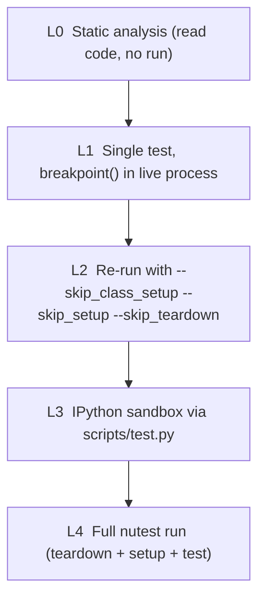
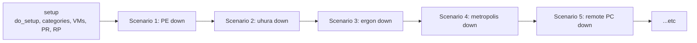

# Efficient nutest test debugging — the right loop

## TL;DR — the loop you want

```
nutest run --skip_teardown      <-- one time: builds cluster state
            +  breakpoint()      <-- inside the test, on the failing line
in IPython: fix code, importlib.reload(...), re-run only the failing block
when done:  remove breakpoint, run once more to confirm
```

Three things change vs your current loop:
1. The test process **stays alive** at the failure (`breakpoint()` instead of running to the end and reading logs).
2. You keep `self`, `self.draas_wo`, `self.test_args`, and `#TAG` resolution — because you're *inside* the test method.
3. Edits become live via `importlib.reload`; you re-call functions on the same `self`, no nutest restart.

---

## The 5-layer debugging pyramid

Use the cheapest layer that gives you a real answer. Climb the pyramid only when forced.



### Layer 0 — static analysis (free, instant)

- Use the [draas-test-debugging.mdc](.cursor/rules/draas-test-debugging.mdc) playbook checklist.
- Open the failure in Cursor, ask the agent: "trace this error from the stack trace to the raising method and find the test config field that controls it". Most logic bugs are findable here.
- Only escalate if static reading doesn't yield a hypothesis.

### Layer 1 — breakpoint inside the live test (the missing tool)

Edit the test file, drop a hard breakpoint AT the failing line (or just before). The shape matters:

```python
STEP("Triggering recovery plan job FAILOVER")
try:
  self.draas_wo.trigger_rpj(recovery_plan=rp, action='FAILOVER')
  # === DEV BREAKPOINT — remove before pushing ===
  from IPython import embed; embed()
  # =============================================
```

Then run the test **once** with `--skip_teardown` so the cluster doesn't get nuked when you exit:

```bash
nutest run --tests dr.draas.merged_tests.recovery_plan_unplanned_failover.\
test_recovery_plan_unplanned_failover.NegativeTest.test_upfo_error_scenarios \
--verbose --no_log_collection --skip_teardown \
--resources NOS:auto_cluster_nested_69e4be2592fce947b140928b \
            NOS:auto_cluster_nested_69e4be2592fce947b140928c \
            NOS:auto_cluster_nested_69e4be2592fce947b140928d \
            PC:10.61.4.2 PC:10.61.4.21
```

When IPython opens you have `self`, `self.draas_wo`, `self.remote_pc`, `self.test_args`, `#TAG` lookups via `self.draas_wo.dr_config.get_entities(...)` — all real, all wired to the live cluster.

Now iterate **without** restarting nutest:

```python
# 1. Inspect what's wrong
self.draas_wo.pc_entities[self.remote_pc.svms[0].ip][DraasWorkflow.RPJ].get()

# 2. Edit the helper module in Cursor (or another terminal), save.

# 3. Hot-reload in-place
import importlib
from workflows.draas import draas_library
importlib.reload(draas_library)

# 4. Re-call the failing operation directly
draas_library.verify_warning_error_recovery_validation(...)
```

Caveats: `importlib.reload` works for plain modules; for already-instantiated classes you may need to re-bind methods or re-instantiate the helper that holds the changed method. For framework-deep changes restart at L2.

### Layer 2 — skip class setup, re-run a fresh process

When the in-process loop is no longer salvageable (you reloaded too much, namespace is dirty) but the **cluster state from your `--skip_teardown` run is still good**:

```bash
nutest run --tests ... \
  --skip_class_setup --skip_setup --skip_teardown \
  --no_log_collection --verbose --resources ...
```

What this preserves: cluster-side state — categories, VMs, snapshots, recovery plans, protection rules, remote-site pairings.

What this **does not** preserve: `self`. Each `nutest run` is a fresh Python process, so `self.draas_wo` is rebuilt by your test method (or skipped if your test reads from cluster). For the unplanned-failover test, `setup()` rebuilds `self.draas_wo` cheaply from cluster discovery, so iteration is still much faster than full setup.

### Layer 3 — IPython sandbox (scripts/test.py)

This is your current approach in [scripts/test.py](scripts/test.py). Keep using it for:
- Bootstrapping cluster objects before any test has run.
- Probing entity state on a setup that wasn't created by your test method (someone handed you a setup).
- One-off experiments that don't map to a specific test.

But — for fixing a specific failing test — Layer 1 is strictly better because you keep `self` and tag resolution.

One upgrade to scripts/test.py that gives you the best of both worlds: instantiate the test class directly and call its `setup()`:

```python
from testcases.dr.draas.merged_tests.recovery_plan_unplanned_failover.\
    test_recovery_plan_unplanned_failover import NegativeTest

t = NegativeTest()
t.pe_clusters = pe_clusters
t.pc_clusters = pc_clusters
t.test_args = {"dummy_vm": False, ...}  # match config.json
t.setup()
# Now `t.draas_wo`, `t.source_pc`, ... exist exactly as in the test.
# Call any sub-step:
t.draas_wo.trigger_rpj(recovery_plan=rp, action='FAILOVER')
```

### Layer 4 — full clean run

Only when:
- You changed `setup()` itself, or
- Cluster state is corrupted (failed teardown, leftover PDs, dangling RPJs that block creation), or
- You're doing a final verification before pushing.

---

## Specific playbook for `test_upfo_error_scenarios`

`test_upfo_error_scenarios` has ~8 independent failure-injection scenarios in sequence (PE down → uhura down → ergon down → metropolis down → remote PC down → SVM down → ...). You almost never need to re-run the whole thing.



### Step-by-step

1. **Identify the failing scenario.** Read the log, find the last `STEP(...)` line before the exception. Map it back to the test file. (Example: failure at `STEP("Stopping ergon service on remote PE.")` at [test_recovery_plan_unplanned_failover.py:599](nutest-py3-tests/testcases/dr/draas/merged_tests/recovery_plan_unplanned_failover/test_recovery_plan_unplanned_failover.py).)

2. **Drop a breakpoint at the start of that scenario block, NOT at the failure line.** This lets you single-step through the few statements in that scenario interactively:

   ```python
   STEP("Stopping ergon service on remote PE.")
   from IPython import embed; embed()      # <-- here
   remote_pe = self.remote_pe_list[0]
   Ergon(remote_pe).stop()
   ...
   ```

3. **Run once with --skip_teardown** so failed-state isn't cleaned up while you're poking around.

4. **In IPython, execute the scenario's statements one at a time.** When something behaves wrong, you have all the inspect tools you need. Apply the [draas-test-debugging.mdc](.cursor/rules/draas-test-debugging.mdc) checklist.

5. **For fixes in workflow / helper code** (`draas_library`, `DraasWorkflow`): edit on disk → `importlib.reload(module)` → call again. For test-file changes: exit IPython, re-edit, re-run with `--skip_class_setup --skip_setup --skip_teardown`.

6. **Verification pass**: remove breakpoint, full clean run.

### Optional accelerator: split the megatest in a dev branch

Not part of the fix itself, but if you'll be touching this test repeatedly, extract each scenario into its own private method and have `test_upfo_error_scenarios` call them in sequence. Then your dev runs only execute the failing scenario. Don't merge that split unless the team agrees, but it pays for itself on the third iteration.

---

## Cursor efficiency — connect directly to the ubvm

Stop copying files. Run Cursor on the Mac UI but point its filesystem/terminal/AI at the ubvm.

### Setup (one-time, ~5 minutes)

1. On Mac: ensure passwordless SSH to ubvm works (`ssh ubvm` should drop you in without a password). Add the entry to `~/.ssh/config` if not already:

   ```
   Host ubvm
     HostName <ubvm-ip>
     User <user>
     IdentityFile ~/.ssh/id_rsa
     ServerAliveInterval 60
   ```

2. In Cursor on Mac: open the command palette (`Cmd+Shift+P`) → "Remote-SSH: Connect to Host" → pick `ubvm`. Cursor reopens connected to the ubvm. (Cursor ships VS Code's Remote-SSH; no extra extension install needed in most builds. If missing, install "Remote - SSH".)

3. Open the nutest workspace folder on the ubvm. Cursor's AI agent, file edits, terminals, language server, and IPython all now run on the ubvm. Your Mac is just the UI.

### What changes in your workflow

- Edit → save → run is one keystroke loop; no scp.
- Cursor's agent (this chat) sees the ubvm filesystem directly. Less drift between "what I edited" and "what's running".
- `breakpoint()` workflow above happens inside Cursor's integrated terminal on the ubvm. You can split the terminal: one running nutest, one for ad-hoc IPython.

### IDE breakpoints (optional, instead of `IPython.embed()`)

If you prefer GUI breakpoints over IPython:
- Install `debugpy` in the nutest venv on the ubvm.
- Add `import debugpy; debugpy.listen(5678); debugpy.wait_for_client()` to the test (or as a launch wrapper).
- Cursor → Run and Debug → "Attach to Python" pointing at `localhost:5678` (Remote-SSH forwards the port automatically).
- Set breakpoints by clicking gutter, inspect `self.*` in the Variables pane.

`IPython.embed()` is simpler and equally powerful for nutest work; pick whichever fits your muscle memory.

---

## Anti-patterns to retire

- **End-to-end run → read log → fix → end-to-end run.** Megatests punish this loop linearly with their length.
- **`scripts/test.py` to debug a specific test failure.** Use Layer 1 instead — you get `self` and tag resolution for free.
- **Editing on Mac, scp to ubvm.** Replaced by Cursor Remote-SSH.
- **Running setup just to inspect a property.** `--skip_class_setup --skip_setup` against a `--skip_teardown` setup is your friend.